# Extract data from the SAP GUI UI with Power Automate

When you create or update records in SAP, it generates status information which includes the newly generated record IDs. SAP displays this status information in the lower part of the SAP UI.

Here's a sample status message that SAP displays after you create an SAP PM notification.


This status information might be useful for the automation process steps later. Therefore you should extract and assign this status data to variables for downstream data processing. 

We have multiple ways to achieve this, depending on your development approach. The two approaches are [low-code](#low-code-approach) or [pro-code](#pro-code-approach) techniques.

## Pro-code approach

The pro-code approach uses VBScript commands to extract information from SAP UI elements.

To extract SAP status data, such as a newly created purchase requisitions or plant maintenance notification numbers, you need access to the status bar UI element.  

Here's how you access the status bar UI element.

<!--todo confirm this is vbscript-->
``` vbscript
session.findById("wnd\[0\]/sbar/pane\[0\]").Text
```

Let's walk through the end-to-end experience. We'll record how to create an SAP PM Notification and modify  the code that's generated to return the newly created Id to Power Automate Desktop. 

In case you've never heard of SAP's PM Notification or you don't have access to it, don't worry you'll still be able understand the steps needed to extract such data for your own scenario.

Here are the steps:

1. Confirm that all [SAP GUI scripting configurations](./prerequisites.md#sap-gui-scripting-configuration) are done.

1. Open **SAP Logon** and select the SAP system to which you want to sign in.

   

1. Select **Customize Local Layout** (**Alt**+**F12**), and then select **Script Recording and Playback...**.

   

1. Select **More**.

1. Under **Save To**, provide the file path and filename where you want to store the captured user interactions.

   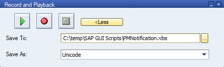

1. Select the **Record Script** button to start the screen capturing process. Every interaction you do now in SAP is captured as repeatable VBScript commands. 

   >[!NOTE]
   >If you recorded steps and saved to this file before, you'll need to confirm if you want to overwrite the file.

1. Enter transaction code **IW21**, and then select **Enter**.

1. Provide the **Notification type**, and then select **Enter**.

1. Enter a **Short Text**, **Planner Group**, **Main WorkCtr**, and any other field that you need.

   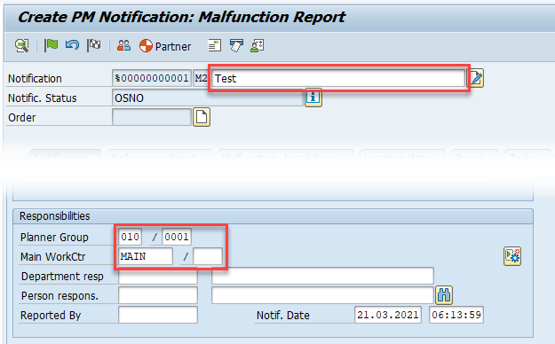

1. Select **Save** (**Ctrl**+**S**) on the toolbar.

1. Back in the **Create PM Notification** **initial** form, you'll notice a new status message in the status bar in the lower-left corner of the UI.

   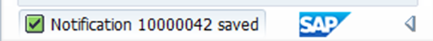

1. Select **Exit** (**Shift**+**F3**) on the toolbar, and then **stop the recording**.

1. Optionally, log off from SAP and close all SAP windows.

Let's examine the generated VBScript code:

:::image type="complex" source="media/VBsceript-code-for-SAP-GUI-UI.png" alt-text="Screenshot of VBScript generated during SAP Notification creation.":::
   Screenshot of VBScript generated during SAP Notification creation  If Not IsObject application  Then       Set SapGuiAuto    GetObject  quot SAPGUI quot         Set application   SapGuiAuto GetScriptingEngine    End If    If Not IsObject connection  Then       Set connection   application Children 0     End If    If Not IsObject session  Then       Set session      connection Children 0     End If    If IsObject WScript  Then       WScript ConnectObject session       quot on quot        WScript ConnectObject application   quot on quot     End If    session findById  quot wnd 0  quot   maximize    session findById  quot wnd 0  tbar 0  okcd quot   text    quot IW21 quot     session findById  quot wnd 0  quot   sendVKey 0    session findById  quot wnd 0  usr ctxtRIWO00 QMART quot   text    quot M2 quot     session findById  quot wnd 0  usr ctxtRIWO00 QMART quot   caretPosition   2    session findById  quot wnd 0  quot   sendVKey 0    session findById  quot wnd 0  usr subSCREE shortened command     quot   text    quot My Notification Short Text quot     session findById  quot wnd 0  usr tabsTAB_ shortened command     quot   text    quot 010 quot     session findById  quot wnd 0  usr tabsTAB_ shortened command     quot   text    quot 0001 quot     session findById  quot wnd 0  usr tabsTAB_ shortened command     quot   text    quot MAIN quot     session findById  quot wnd 0  usr tabsTAB_ shortened command     quot   setFocus    session findById  quot wnd 0  usr tabsTAB_ shortened command     quot   caretPosition   4    session findById  quot wnd 0  tbar 0  btn 11  quot   press    session findById  quot wnd 0  tbar 0  btn 15  quot   press.
:::image-end:::

<!--![Screenshot of VBScript generated during SAP Notification creation  If Not IsObject application  Then       Set SapGuiAuto    GetObject  quot SAPGUI quot         Set application   SapGuiAuto GetScriptingEngine    End If    If Not IsObject connection  Then       Set connection   application Children 0     End If    If Not IsObject session  Then       Set session      connection Children 0     End If    If IsObject WScript  Then       WScript ConnectObject session       quot on quot        WScript ConnectObject application   quot on quot     End If    session findById  quot wnd 0  quot   maximize    session findById  quot wnd 0  tbar 0  okcd quot   text    quot IW21 quot     session findById  quot wnd 0  quot   sendVKey 0    session findById  quot wnd 0  usr ctxtRIWO00 QMART quot   text    quot M2 quot     session findById  quot wnd 0  usr ctxtRIWO00 QMART quot   caretPosition   2    session findById  quot wnd 0  quot   sendVKey 0    session findById  quot wnd 0  usr subSCREE shortened command     quot   text    quot My Notification Short Text quot     session findById  quot wnd 0  usr tabsTAB_ shortened command     quot   text    quot 010 quot     session findById  quot wnd 0  usr tabsTAB_ shortened command     quot   text    quot 0001 quot     session findById  quot wnd 0  usr tabsTAB_ shortened command     quot   text    quot MAIN quot     session findById  quot wnd 0  usr tabsTAB_ shortened command     quot   setFocus    session findById  quot wnd 0  usr tabsTAB_ shortened command     quot   caretPosition   4    session findById  quot wnd 0  tbar 0  btn 11  quot   press    session findById  quot wnd 0  tbar 0  btn 15  quot   press.](media/VBsceript-code-for-SAP-GUI-UI.png)-->

Now, let's adjust the generated code to include a step that extracts, trims, and then returns the new notification ID to the **Run VBScript** action.

:::image type="complex" source="media/VBscript-code-for-SAP-GUI-UI-adjusted.png" alt-text="Screenshot of adjusted VBScript that returns SAP Notification to Power Automate Desktop via a variable.":::
   Screenshot of adjusted VBScript that returns SAP Notification to Power Automate Desktop via a variable    39  This is the Save button    session findById  quot wnd 0  tbar 0  btn 11  quot   press      39  This is the full Status Bar text that contain the data to be extracted    statusBarMessage   session findById  quot wnd 0  sbar pane 0  quot   text      39  Trimming and removing any text surrounding our new notification Id    notificationID   Trim  Replace  Replace  statusBarMessage   quot Notification quot    quot  quot     quot saved quot    quot  quot            39  This is the Exit button    session findById  quot wnd 0  tbar 0  btn 15  quot   press      39  This writes the newly created Id to the Run VBScript output variable in Power Automate Desktop    WScript Echo notificationID.
:::image-end:::


<!--![Screenshot of adjusted VBScript that returns SAP Notification to Power Automate Desktop via a variable    39  This is the Save button    session findById  quot wnd 0  tbar 0  btn 11  quot   press      39  This is the full Status Bar text that contain the data to be extracted    statusBarMessage   session findById  quot wnd 0  sbar pane 0  quot   text      39  Trimming and removing any text surrounding our new notification Id    notificationID   Trim  Replace  Replace  statusBarMessage   quot Notification quot    quot  quot     quot saved quot    quot  quot            39  This is the Exit button    session findById  quot wnd 0  tbar 0  btn 15  quot   press      39  This writes the newly created Id to the Run VBScript output variable in Power Automate Desktop    WScript Echo notificationID.](media/VBscript-code-for-SAP-GUI-UI-adjusted.png)-->

This sets the **VBScriptOutput** variable of the **Run VBScript** action to the newly created notification ID.

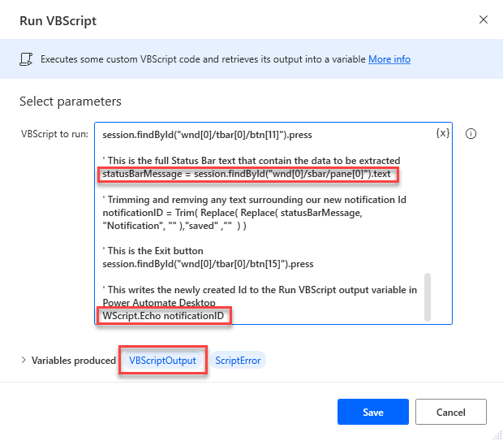

If you want to see the contents of the VBScriptOutput, you can use a display message action, similar to the output in the following images.

 

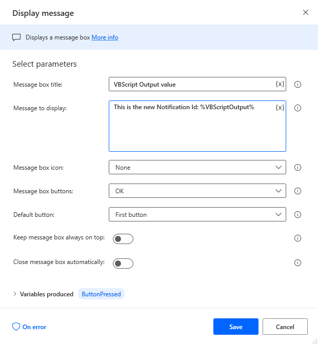

## Low-code approach

The low-code approach uses actions and custom selectors to extract newly generated record IDs or other status messages that are important for downstream flow processing.

The following steps won't go into detail about how to record or use manual action design to create a new SAP PM Notification record. Please review [Low-code](action-based-sap-gui-automation-manually-overview.md) or [No-code RPA with SAP GUI in Power Automate Desktop](action-based-SAP-GUI-automation-recorder-overview.md) if you need a refresher on how to do that.<!--note from editor: These links correspond to "section 6 or 7" in the Word doc, perhaps they're the right ones?-->
<!--confirm the numbers for the sections-->

Follow these steps for a low-code approach:

1. Use the desktop recorder or manual action design to capture all controls that you need for the SAP PM Notification process.

1. Create a notification record, and capture the status text that appears after you select **Save** on the toolbar of the **Create PM Notification** screen.

   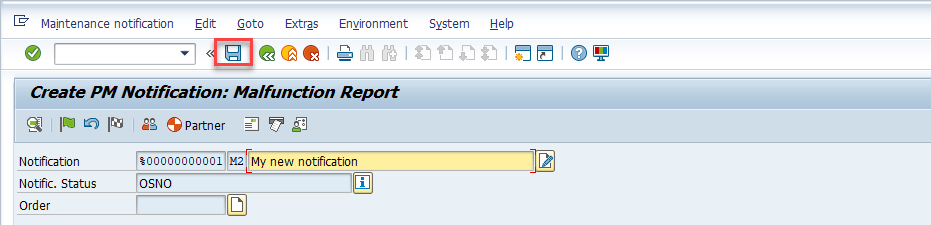

   After the item is saved, you'll be redirected to the previous screen where you should see a new notification number in the status bar text.

1. Now, go back to Power Automate Desktop, search for an action named **Get details of a UI element in window**, and add it to your authoring canvas.

1. Select the UI element dropdown menu, and then select **Add a new UI element** button.

   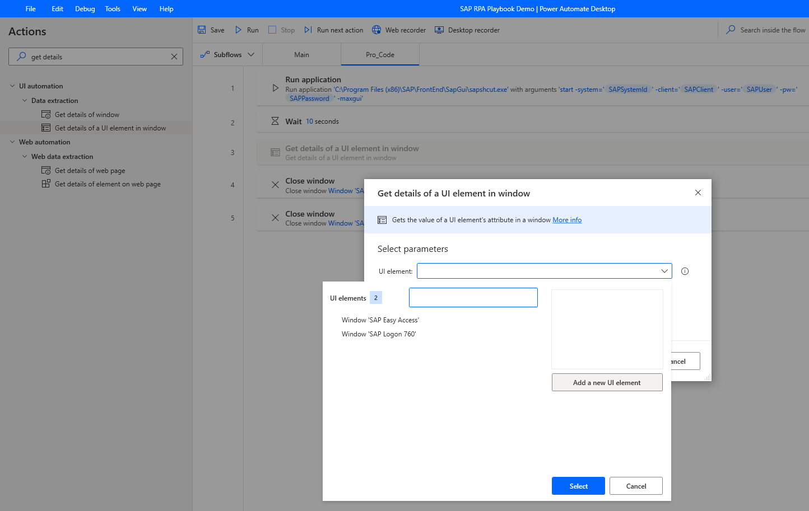

1. Select the **SAP Easy Access** window and hover over the status bar until a red border labeled **Gui Statusbar** appears. While the border is active, hold down **Ctrl** and then click to select the status bar.

   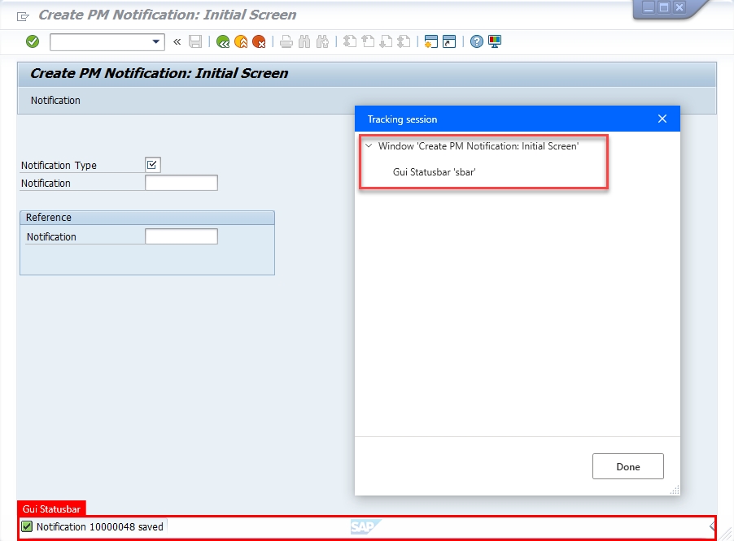

1. Select **Save**.
   
   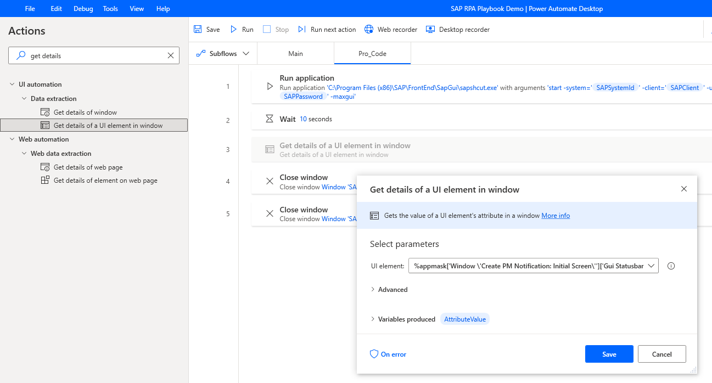

1. Search for the **Replace text** action in the **Actions** pane, and drag it onto the design canvas.

1. In **Text to find**, enter **Notification**. Under **Replace with**, enter a blank string by entering the following characters: **%''%**

    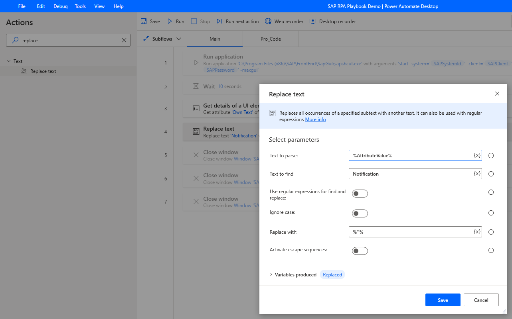

1. Add another **Replace text** action, and rename the **Variables produced** to **%NotificationId%**. In **Text to find**, enter **save**, and under **Replace with**, enter a blank string (**%''%**).

    

1. Search for the **Trim text** action on the **Actions** pane, drag it onto the design canvas, select **%NotificationId%** as **Text to trim** value and rename **Variables produced** to **%TrimmedNotificationID%**.

    

1. Search for the **Display message** action on the **Actions** pane, and drag it onto the design canvas. Set **Message box title** and **Message to display** to suit your needs.

    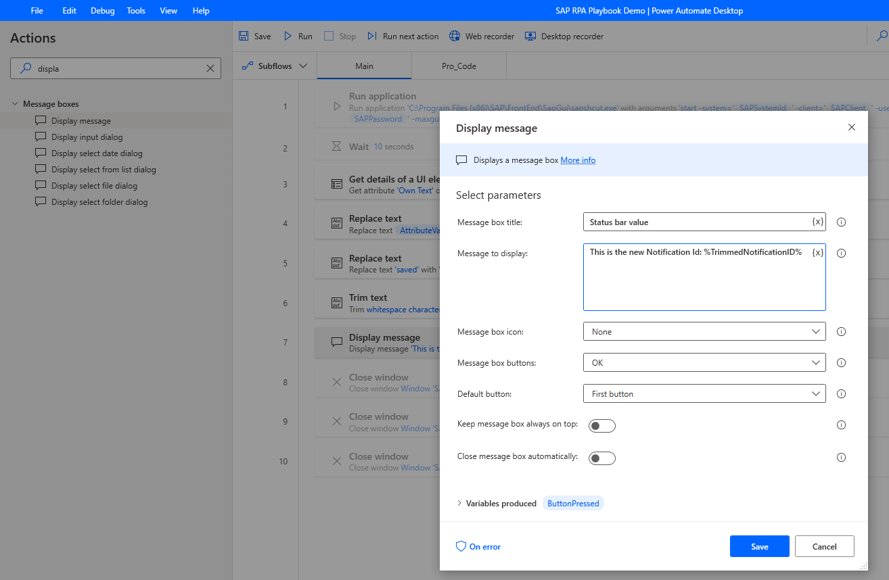

1. Run the automation that creates a new SAP PM Notification and extracts its newly generated notification ID that can be displayed as shown in the following image.

    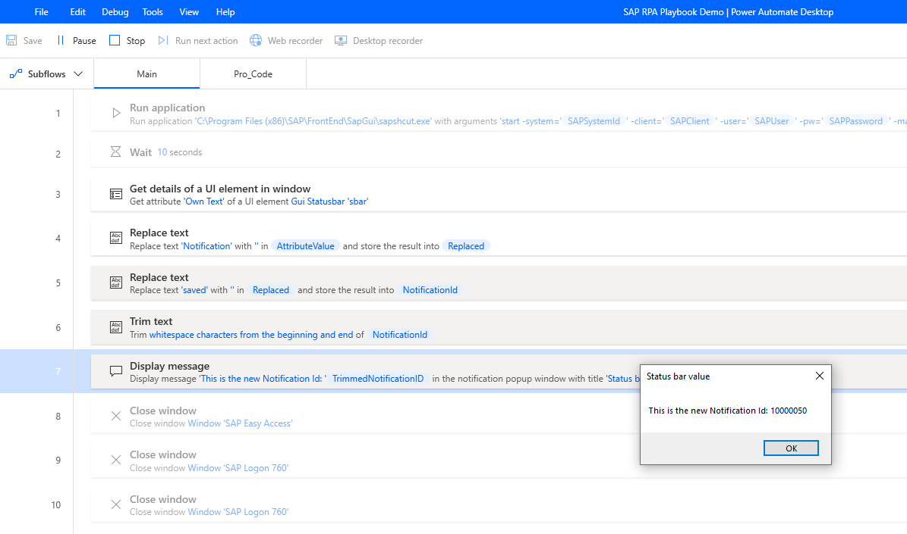


> [!div class="nextstepaction"]
> [Next step: Summary of the benefits of VBScript vs. actions for SAP GUI automation](feature-highlights-per-approach.md)
