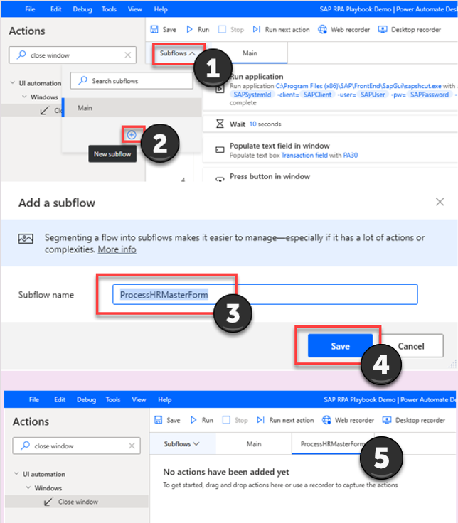
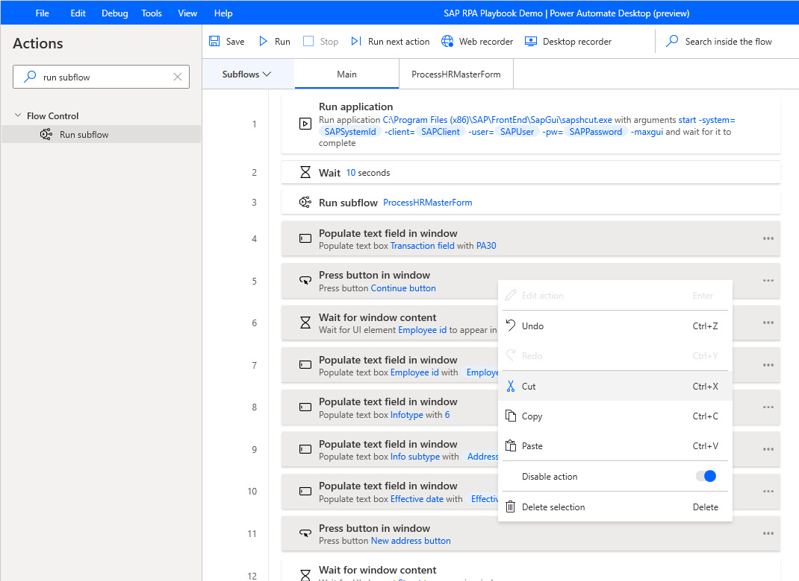
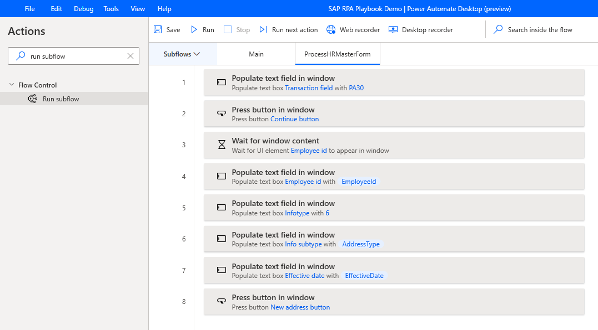
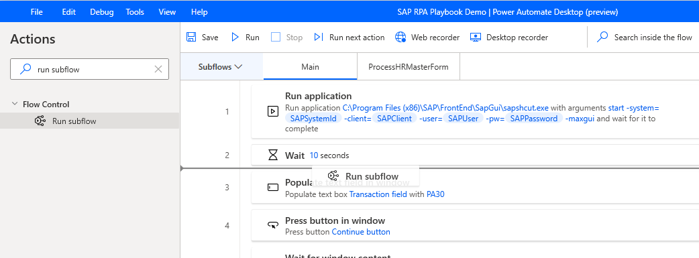
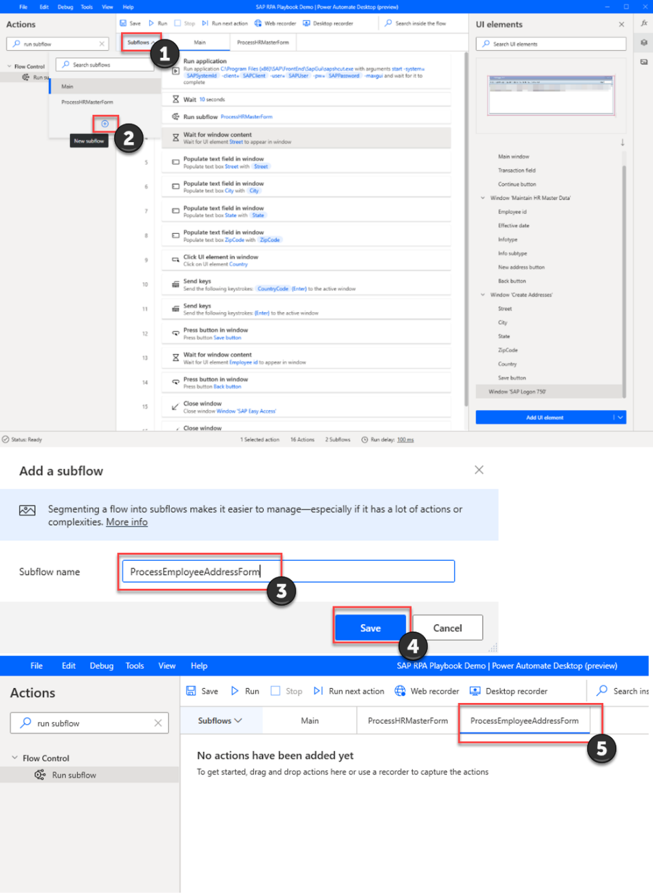
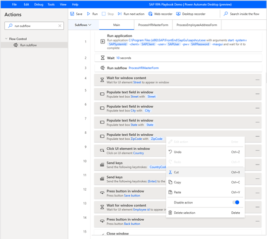
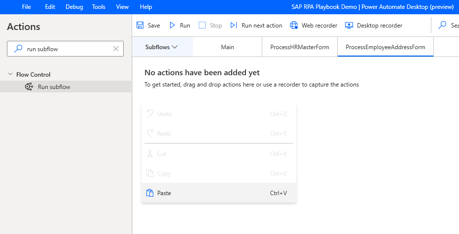
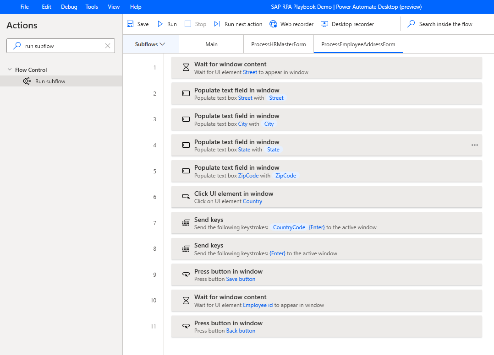
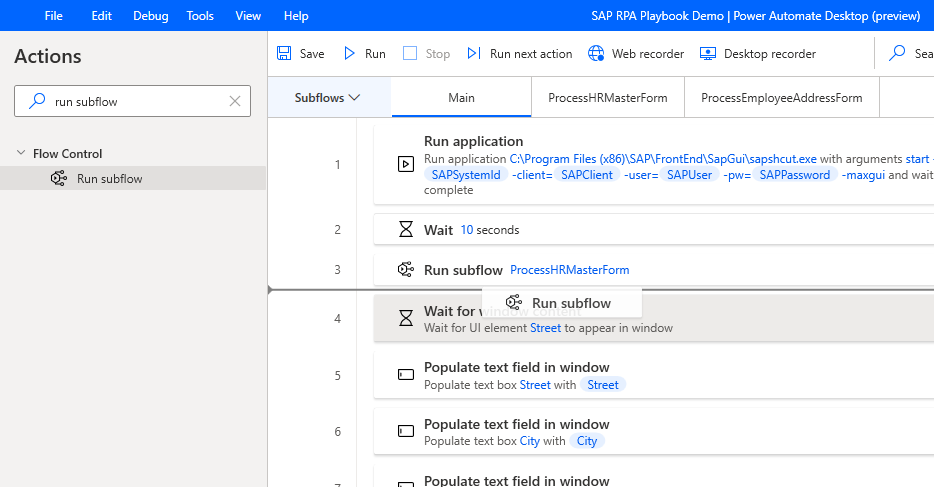

# Create a subflow for SAP GUI automation

Now, let's modularize our current flow by moving actions that carry out specific interdependent tasks (in our scenario, filling out a form) into a new subflow.

1. Create a new subflow, name it **ProcessHRMasterForm**, and then select **Save**.

   

2. Go to the **Main** tab for the **Subflows** area, select the highlighted actions shown in the following image (rows 4 through 11), right-click, and then select **Cut**.

   

3. Go to the **ProcessHRMasterForm** tab, right-click to select it, and then select **Paste**.

   

4. Go back to the **Main** tab.

5. In the **Actions** search box, enter **run subflow**, and then drag the **Run subflow** action onto the canvas. For **Call subflow**, select **ProcessHRMasterForm**, and then select **Save**.

   

6. Create another subflow, name it **ProcessEmployeeAddressForm**, and then select **Save**.

   

7. Go back to the **Main** tab.

8. On the **Main** tab, select the highlighted actions shown in the following image (rows 4 through 14), right-click, and then select **Cut**.

   

9. Go to the **ProcessEmployeeAddressForm** tab, right-click to select it, and then select **Paste**.

   

   

10. Go back to the **Main** tab.

11. In the **Actions** search box, enter **run subflow**, and then drag the **Run subflow** action onto the canvas. For **Call subflow**, select **ProcessEmployeeAddressForm**, and then select **Save**.

    

> [!div class="nextstepaction"]
> [Next step: Get ready to debug](getting-ready-to-debug.md)
