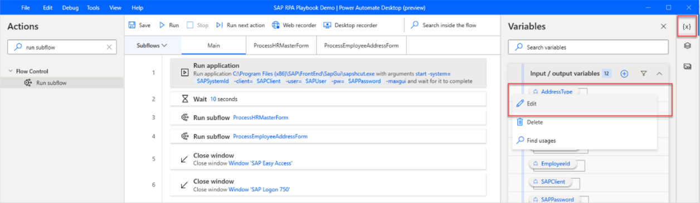
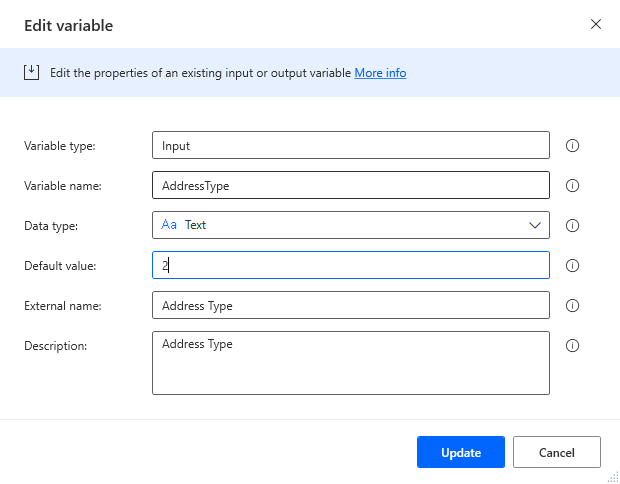
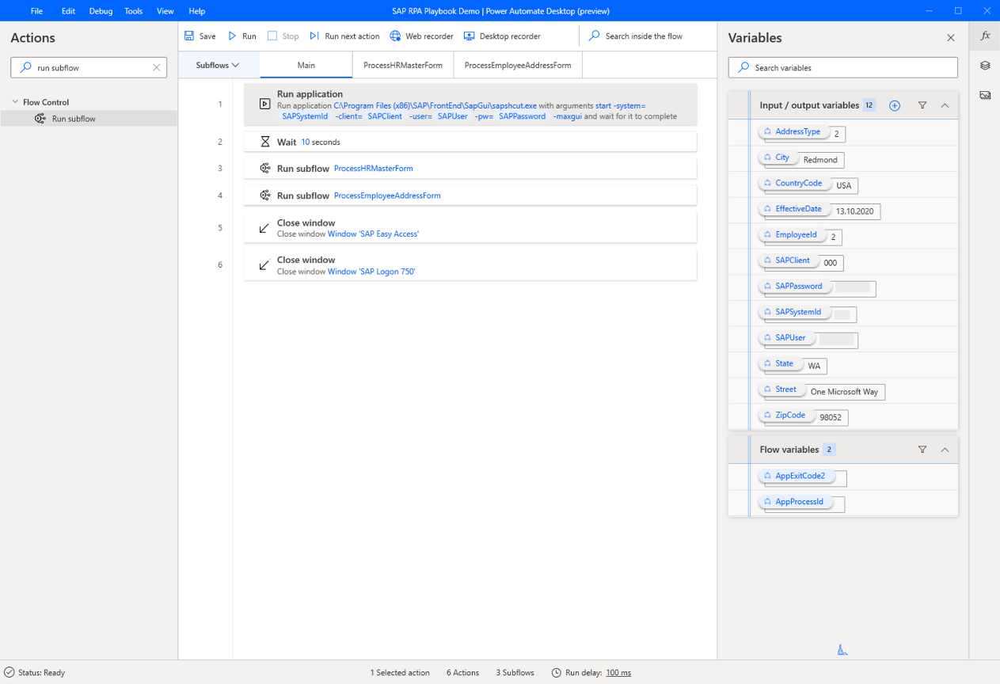
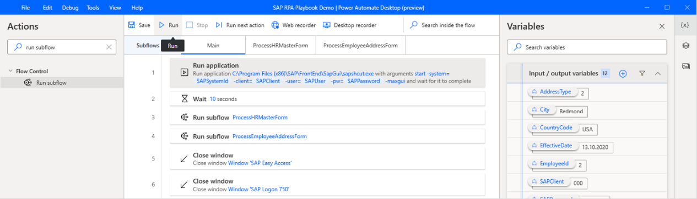

# Get ready to debug

Before we continue with the primary flow in the Power Automate portal, let's test the flow by temporarily assigning a default value to the variables that we defined earlier.

1. In the **Variables** pane, select **More** (**…**) next to the **AddressType** variable name, and then select **Edit**.

   

1. For **Default value**, enter **2** (for example, for a temporary address).
   
1. Select **Update**.

   

1. Repeat steps 1 and 2 for the other 11 variables.

   

1. Select **Save**, close the confirmation dialog, and then select **Run**.

   

If you run into an error as your flow is executed for this test run, observe the error status bar in the lower part of the Power Automate Desktop designer and apply the appropriate fix.

>[!IMPORTANT]
>Delete all default values before you leave the desktop flow authoring experience in Power Automate Desktop.

> [!div class="nextstepaction"]
> [Next step: Create the cloud flow to update an address with Power Automate](creating-cloud-flow-to-update-address.md)
