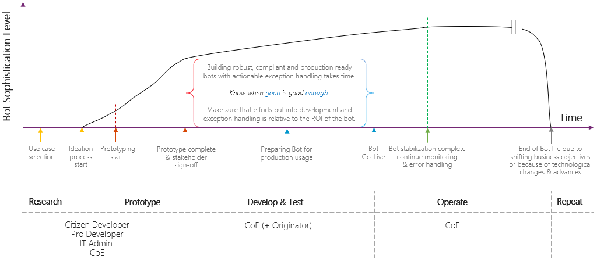

# Introduction to SAP GUI–based RPA in Power Automate Desktop

Robotic process automation (RPA) enables you to automate mundane, rules-based tasks. With RPA, you can automate legacy software without APIs, which opens the world of automation to include software that's old or new, on-premises or in the cloud.

Executives who implemented RPA in their organizations have experienced the positive impact it brings. Increasing the level of automation is a top strategic priority at most organizations.

Many of these of organizations use SAP to manage their finance, supply chain, production, and human resources processes. They're looking for ways to automate their most frequent, mundane, and rules-based tasks. That's exactly what we'll be focusing on in this playbook: SAP GUI automation patterns and best practices using Microsoft Power Automate, Power Automate Desktop, and desktop flows.

Here's an introductory video for the series of automating SAP GUI-based applications with Power Automate Desktop:

> [!VIDEO https://learn-video.azurefd.net/vod/player?id=a6204d2c-d98b-4e43-915a-4ad14f70cd45]

## Lifecycle of a typical enterprise RPA bot

Power Automate empowers everyone to automate while providing security, compliance, and control over the usage and execution of automation across the IT ecosystem, whether on-premises or in the cloud.

This playbook takes you through prototyping the automation of an example SAP scenario. However, it's important to understand that building sophisticated, robust, and impactful RPA solutions that span multiple legacy systems takes time. And, as shown in the following image, most of this time is spent on production readiness, including advanced retry and exception handling.

  

> [!div class="nextstepaction"]
> [Next step: Prerequisites for automating RPA SAP GUI](prerequisites.md)
