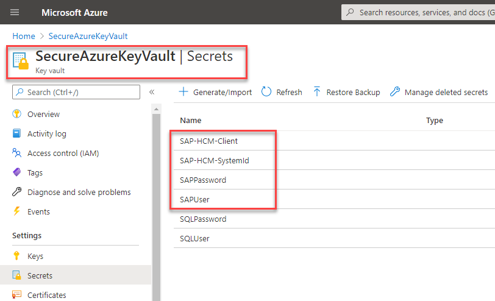

# Prerequisites for automating SAP GUI-based workloads

The following prerequisites need to be met before you can start automating your SAP GUI–based workloads.

## License requirements

To build RPA solutions with Power Automate, you'll need one or more of the following licenses or add-ons:

- Power Automate Premium (or trial, previously Power Automate per user plan with attended RPA)

- Power Automate Process plan (previously Power Automate per flow and Power Automate unattended RPA add-on)

## Software requirements

Before you can use your device to create desktop flows and Power Automate Desktop processes, you'll need to ensure that it meets the requirements outlined in [Set up Power Automate Desktop](../../desktop-flows/setup.md).

The following software components are required on Windows 10 Pro devices:

- [The latest version of .NET Framework](https://dotnet.microsoft.com/download/dotnet-framework)(a reboot might be required)

- [The latest version of desktop flows](../../desktop-flows/setup.md), which includes Power Automate Desktop and browser extensions (make sure you've enabled the browser extensions)

- [Microsoft Edge](https://www.microsoft.com/edge/) or Google Chrome browser

- [On-premises data gateway](../../gateway-reference.md#use-a-gateway) (make sure the data gateway region matches your environment's region) or use the latest [direct machine connectivity option](../../desktop-flows/manage-machines.md).

- **SAP GUI for Windows** (ask your administrator for details).

## SAP GUI scripting configuration

Before you can use the SAP scripting engine, configure or confirm the following:

1. Enable SAP scripting.

    1. Open SAP GUI.

    1. Open transaction **RZ11**.

    1. Enter **sapgui/user\_scripting** into the **Parameter Name** field.

    1. Select **Display**.

    1. Confirm that under **Value of Profile Parameter sapgui/user\_scripting**, **Current Value** is set to **TRUE**.  If it's **FALSE**, select **Change Value**, enter **TRUE** in the **New Value** field, and then select **Save**.

    1. Confirm with the SAP team that **S\_SCR** authorization is assigned to all automating users.

         >[!NOTE]
         >After you've changed the value, you might get a warning that says, "Change not permanent, will be lost at server restart." To avoid this issue, make the configuration permanent on the server side by using transaction **RZ10** instead. You'll need to restart the SAP server for these settings to take effect.

2. Open **SAP GUI Options**, go to **Accessibility & Scripting** > **Accessibility** > **Use accessibility mode**, and then select any other checkboxes that you need.

3. Open **SAP GUI Options** > **Accessibility & Scripting** > **Scripting**, and under **User Settings**, select **Enable scripting**. Clear all other options.

4. On the **SAP GUI Options** screen, go to **Security** > **Security Settings**, and under **Security Module**, select **Open Security Configuration**. Change the **Default Action** to meet your specific requirements, and then select **Ok**.

     >[!TIP]
     >You can select **Allow** as **Default Action** to avoid a security dialog appearing during file save operations.

5. **Gather use-case reference test data**: Search for an active employee in your SAP system and make a note of their **Personnel number**. Also make a note of a valid **Info subtype** (for example, **2 = Temporary address**). 

   >[!NOTE]
   >The address format we're using in the sample use case is based on US requirements. Depending on your requirements, the field list and mandatory fields might be different, so make sure you select controls that are relevant to your setup.

6. Close all SAP sessions and windows.

## Azure Key Vault credentials (optional)

Although this configuration step isn't mandatory for creating and running desktop flows, we highly recommend that you use [Azure Key Vault](https://azure.microsoft.com/services/key-vault) as a central cloud repository for your secure strings, such as SAP passwords and SAP usernames. For the scenario in this playbook, we've created four use-case–specific secrets on Key Vault. We'll use these secrets later to pass to our desktop flow as secure inputs. More information: [Key Vault](https://azure.microsoft.com/services/key-vault/)

  

> [!div class="nextstepaction"]
> [Next step: Core components for Power Automate RPA SAP GUI automation](core-components.md)
