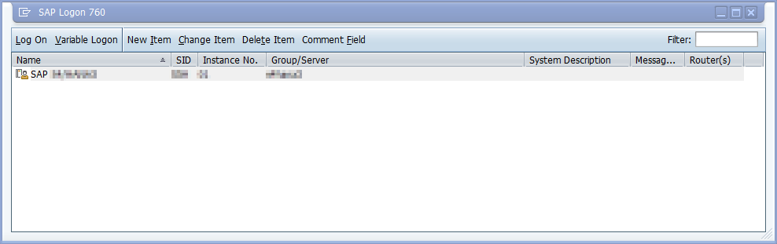

# Use SAP GUI automation engine to record VBScript

1. Confirm that all [SAP GUI scripting configurations](./prerequisites.md#sap-gui-scripting-configuration) are done.

1. Open **SAP Logon**, and then select the SAP system to which you want to sign in.

   

1. Select **Customize Local Layout (Alt F12)**, and then select **Script Recording and Playback**.

   

1. Select **More.**

1. Under **Save To**, provide the path and file name where you want to store the captured user interactions.

   

1. Select **Record Script** to start the screen capturing process.  
    Every interaction you do in SAP will be captured as repeatable VBScript commands.

1. Follow the steps outlined in [Sample SAP GUI automation for this tutorial](sample-sap-scenario.md) to produce a recording.

1. Select the **Record and Playback** dialog, select **Stop Recording**, and then close the dialog.

1. Close all SAP windows now, if you wish.

SAP's scripting engine records each click as VBScript commands and saves it to the output file you provide. Open the file in your code editor of choice to examine its contents.

> [!div class="nextstepaction"]
> [Next step: Review the generated code](reviewing-generated-code.md)
