<properties
   pageTitle="Creating an Approval Request | Microsoft Flow"
   description="Creating an Approval Request in Microsoft Flow"
   services=""
   suite="flow"
   documentationCenter="na"
   authors="msftman"
   manager="anneta"
   editor=""
   tags=""
   featuredVideoId="65yz8tqnWe0"
   courseDuration="4m"/>

<tags
   ms.service="flow"
   ms.devlang="na"
   ms.topic="get-started-article"
   ms.tgt_pltfrm="na"
   ms.workload="na"
   ms.date="08/16/2017"
   ms.author="deonhe"/>

# Creating an Approval Request Flow in Microsoft Flow 
In a previous topic, you saw how to power your Twitter feed with a SharePoint list in a  simple way. In this topic, you’ll learn how to build a more business-friendly scenario using approvals. This way, anyone with access to the SharePoint list can contribute tweets, and the social media team can approve or reject those tweets. The team maintains control of the account and the content that goes out to customers. 

## Create an approval request flow

1. On the **Microsoft Flow** homepage, select **Approvals**, select **Create approval flow**, and then scroll down and select the **Post list items to Twitter after approval** template. 

    

1. Verify your account credentials for **SharePoint**, **Approvals**, and **Twitter**, and select **Continue**. 

    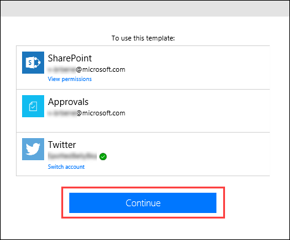

By default, this template starts an approval process whenever a new item is created in a particular list, and if the item is approved, then it posts a tweet to Twitter. In this topic, you’ll modify this process by adding steps that update the SharePoint list with the approval response, indicate whether it was approved or not, and add any comments that the approver may have added to the proposed tweet. 

1. In the **ContosoTweets** SharePoint list that you created previously, add two new columns:
    1. Select the plus sign “**+**”, and select **Yes/No**
    1. Enter **ApprovalStatus** and select **Create**
    1. Select the plus sign “**+**”, and select **Single line of text**
    1. Enter **ApproverComments** and select **Save**

    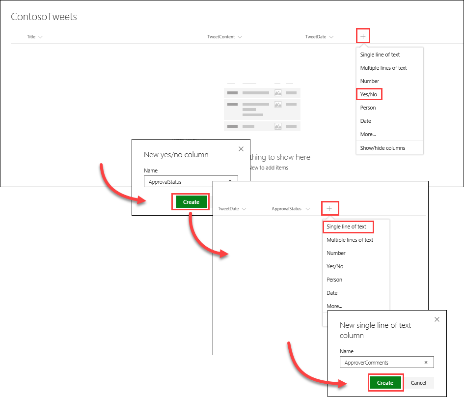

1. Back in **Microsoft Flow**, in the **When a new item is created** action, enter the following values:
    - **Site Address**: your team SharePoint URL
    - **List Name**: ContosoTweets

    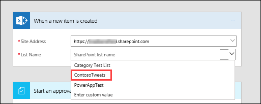

1. In the **Start an approval** action, select **Edit** to display all the fields. 

    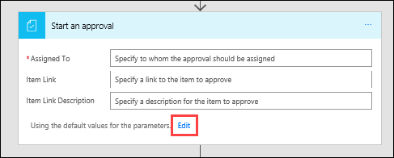

1. In **Title**, enter **New tweet for** and select **Title** from the dynamic content list. 

    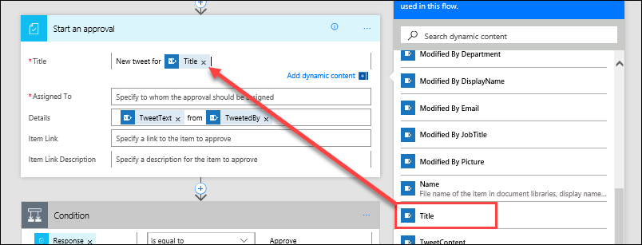

1. In **Assigned to**, enter and select your name, or a test user name. 

    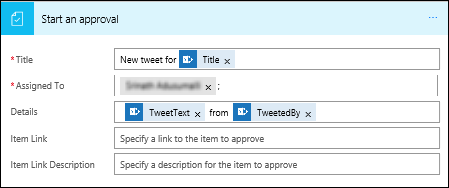

1. In **Details**, remove the default items and add **TweetContent**, **TweetDate** and **Created by DisplayName** from the dynamic content list, connected by the words **on** and **by**. 

    

1. In **Item Link**, copy and paste the URL of your SharePoint list, and in **Item Link Description**, enter **Contoso Tweet List**. 

    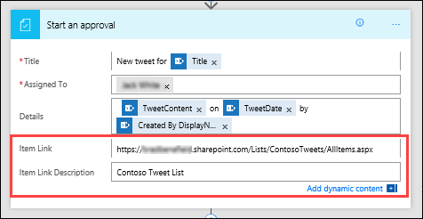

1. In the **Condition** action, hover over the **IF YES** box, select the plus sign “**+**”, and select **Add an action**. 

    

1. Search for **update item**, select the **SharePoint** connector, and select the **SharePoint – Update item** action.

    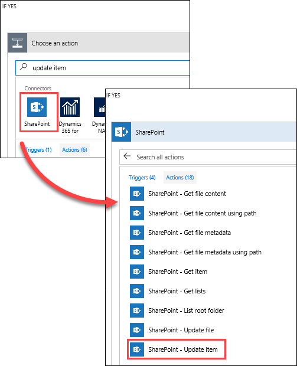

1. In **Site Address** and **List Name**, enter your site URL and the **ContosoTweets** list again, and in **ID**, enter **ID** from the dynamic content list. 

    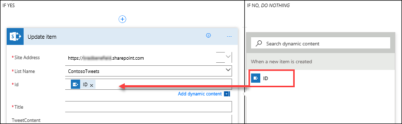

1. Select the **Title** field, and in the dynamic content list, search for **title**. Add the **Title** item from the **When a new item is created** action. 

    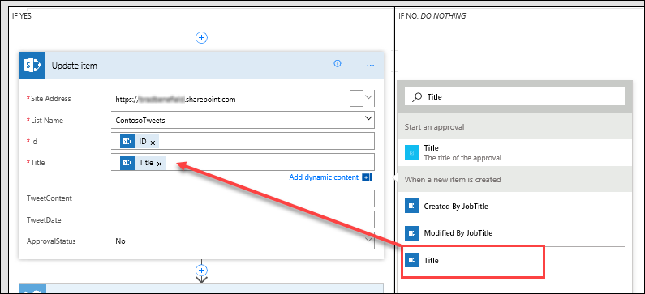

1. Select **ApprovalStatus** and set the value to **Yes**, then select **ApproverComments** and set the value to **Comments** from the dynamic content list. 

    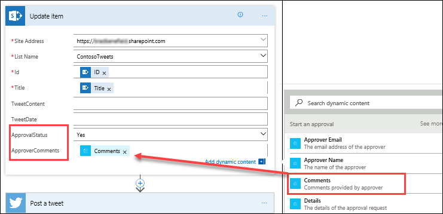

1. Near the bottom of the **IF NO, _DO NOTHING_** box, select **Add an action**.

    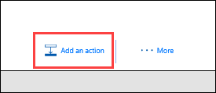

1. Using the same steps that you used for the **IF YES** configuration, create a **SharePoint – Update item** action and configure the fields with the same values, with the exception of setting **ApprovalStatus** to **No**. 

    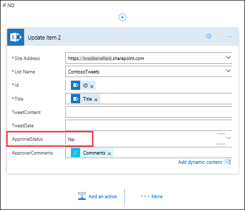

1. Select the **Post a tweet** action, select **Edit**, and set **Tweet text** to **TweetContent** from the dynamic content list.  At the top of the page, select **Create flow** to save your work. 

    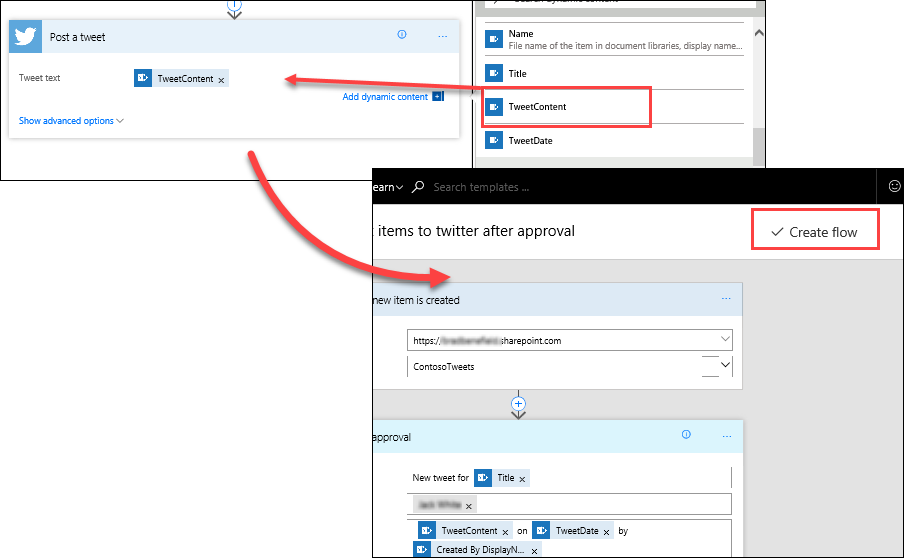

This is just one way that Microsoft Flow can empower productivity for your team. Your team can contribute ideas, relevant news, or product guidance, and you still get to maintain control over what gets tweeted out to customers.

In our next topic, we’ll see what it looks like when an approver receives a new request for a proposed tweet. 

