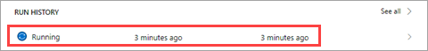

<properties
   pageTitle="Processing an Approval Request | Microsoft Flow"
   description="Processing an Approval Request in Microsoft Flow"
   services=""
   suite="flow"
   documentationCenter="na"
   authors="msftman"
   manager="anneta"
   editor=""
   tags=""
   featuredVideoId="-0r5ZKVEIS4"
   courseDuration="7m"/>

<tags
   ms.service="flow"
   ms.devlang="na"
   ms.topic="get-started-article"
   ms.tgt_pltfrm="na"
   ms.workload="na"
   ms.date="08/16/2017"
   ms.author="deonhe"/>

# Processing an Approval Request in Microsoft Flow 
In a previous topic, you saw how to build an approval process around tweets that are stored in a SharePoint list.  In this topic, you'll see what the experience looks like when an approver receives a new approval request. 

## Create and process a request
First we need to add an item to our SharePoint list, then we can process an approval request for that item.

1. Open the SharePoint list **ContosoTweets**, which was configured in a previous topic.  Select **New** to create a new tweet. 

    

1. Add the following values to the fields, and select **Save**.
    - **Title** – Promotions
    - **TweetContent** – Check out the new line of Contoso Flooring #ohsocontoso
    - **TweetDate** – Today’s date

    

1. In **Microsoft Flow**, select **My Flows**. 

1. Select the **Post list items to Twitter after approval** flow that was configured in the previous topic, then select the running flow under **RUN HISTORY**.

    

1. Select the **When a new item is created** trigger. Verify that the information for the list item you just created is displayed.
  
    

1. In **Outlook**, open the automated approval mail in the inbox, and then select **Approve**. 
 
    

1. In the **Approval Center**, view the details of the request, add a comment, and select **Confirm**. 

    

1. In **SharePoint**, refresh the **ContosoTweets** list and verify that **ApprovalStatus** is **Yes**, and the comment that you entered is displayed. 

    

In this topic, you saw the experience from the approver’s point of view - from receiving an approval request email, to processing the request in the Approval Center.

