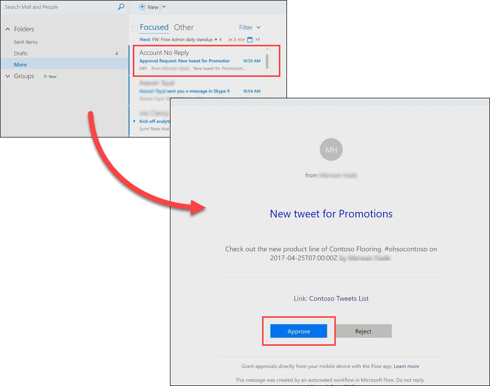

<properties
   pageTitle="Processing an Approval Request | Microsoft Flow"
   description="Processing an Aproval Request in Microsoft Flow"
   services=""
   suite="flow"
   documentationCenter="na"
   authors="v-brbene"
   manager="anneta"
   editor=""
   tags=""
   featuredVideoId="os33pHQ9jSU"
   courseDuration="4m"/>

<tags
   ms.service="flow"
   ms.devlang="na"
   ms.topic="get-started-article"
   ms.tgt_pltfrm="na"
   ms.workload="na"
   ms.date="06/26/2017"
   ms.author="v-brbene"/>

# Processing an Approval Request in Microsoft Flow 
In a previous video, you saw how to build an approval process around tweets that are stored in a SharePoint list.  In this video, you'll see what the experience looks like when an approver receives a new approval request. 

## Create and process a request
Open the SharePoint list **ContosoTweets**, which was configured in a previous video session.  Click **New** to create a new tweet. 

Add the following values to the fields, and click **Save**.
- **Title** – Promotions
- **TweetContent** – Check out the new line of Contoso Flooring #ohsocontoso
- **TweetDate** – Today’s date

In **Microsoft Flow**, select the **Post list items to Twitter after approval** flow that was configured in the previous session, then click the **When a new item is created** trigger. Verify that the information in the tweet that you just created is displayed.
  

In **Outlook**, open the automated approval mail in the inbox, and then click **Approve**. 
 

In the **Approval Center**, view the details of the request, add a comment, and click **Confirm**. 

In **SharePoint**, refresh the **ContosoTweets** list and verify that **ApprovalStatus** is **Yes**, and the comment that you entered is displayed. 

In this video, you saw the experience from the approver’s point of view - from receiving an approval request email, to processing the request in the Approval Center.

In the next video, you'll see how you can set up flows on a recurring schedule.

