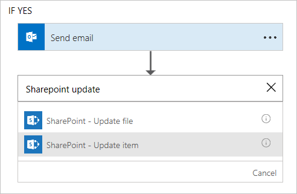
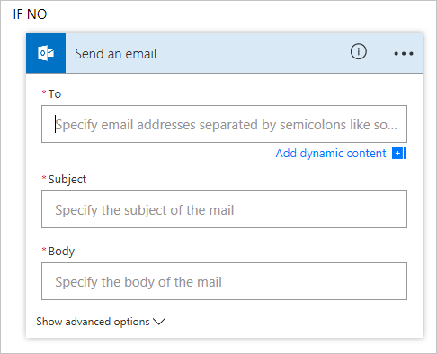

<properties
   pageTitle="Approval Requests with Microsoft Flow | Microsoft Flow"
   description="Learn how to use Microsoft Flow to manage an approval workflow."
   services=""
   suite="flow"
   documentationCenter="na"
   authors="camsoper"
   manager="anneta"
   editor=""
   tags=""
   featuredVideoId="U54cdN0tXEI"
   courseDuration="14m"/>

<tags
   ms.service="flow"
   ms.devlang="na"
   ms.topic="get-started-article"
   ms.tgt_pltfrm="na"
   ms.workload="na"
   ms.date="11/22/2016"
   ms.author="casoper"/>

# Approval requests

In addition to helping you **receive notifications**, **copy files**, and **collect data**, Microsoft Flow can also help you **streamline your approval processes**.

## Vacation scenario

Let’s imagine that you are the **manager** of a team and you ask your employees to create **vacation requests** in a **SharePoint list**. Now you want to build an **approval process** around these list items so that new vacation requests are **quickly processed** and the requestor is **automatically notified**.  

## SharePoint and Microsoft Flow

**SharePoint** has Microsoft Flow **built-in**.  From your **SharePoint list**, click the **Flow** drop down, and then **Create a flow**.

   

In the **menu on the right**, look for a **template** like this.

## Using the template

The **SharePoint** trigger in the template comes **pre-populated** with your list information.  All you need to do is add an **email address** for the **approver**.  Notice that it **doesn't change the original SharePoint item**.  For that, we'll need to add the **SharePoint - Update item** action.

What about the **if no** branch of of *Send emailScope*?  By default, it does nothing.  You might want to add an action to send the author of the request a message telling them their request was rejected. 

## Next lesson

Now we'll review what we learned in this section.