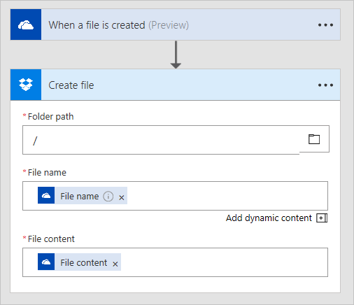

<properties
   pageTitle="Copying Files with Microsoft Flow | Microsoft Flow"
   description="Learn how to use Microsoft Flow to copy files between services."
   services=""
   suite="flow"
   documentationCenter="na"
   authors="camsoper"
   manager="anneta"
   editor=""
   tags=""
   featuredVideoId="liL0IWNcRcc"
   courseDuration="4m"/>

<tags
   ms.service="flow"
   ms.devlang="na"
   ms.topic="get-started-article"
   ms.tgt_pltfrm="na"
   ms.workload="na"
   ms.date="11/22/2016"
   ms.author="casoper"/>

# Copying files

Today, it's very common to use a **file storage service**, such as **OneDrive** or **Google Drive**.  Have you ever needed to **copy files from one storage service to another**?  Microsoft Flow makes it easy to automatically move and copy files between two services.

## Creating flows that copy files

You can **use a template**, like in the video above, or you can create a flow **from scratch**.  Different services have different details and parameters in their **actions**.  In the video, we showed you copying a file from **OneDrive** to **OneDrive for Business**.  Here's another example we created from scratch to copy from **OneDrive to DropBox**.

.

## Next steps

Next, we'll look at how you can **collect data** from services.