<properties
   pageTitle="Create a Flow from a Template | Microsoft Flow"
   description="Create a Flow from a list of templates, manage, and administer the flow."
   services=""
   suite="flow"
   documentationCenter="na"
   authors="v-joaloh"
   manager="anneta"
   editor=""
   tags=""
   featuredVideoId="kZs7lqgp4LU"
   courseDuration="5m"/>

<tags
   ms.service="flow"
   ms.devlang="na"
   ms.topic="get-started-article"
   ms.tgt_pltfrm="na"
   ms.workload="na"
   ms.date="05/11/2017"
   ms.author="v-joaloh"/>

# Guided Learning for Microsoft Flow

Welcome back to **Guided Learning** for Microsoft Flow. In this session, we will start to show you some more of the Microsoft Flow environment, and introduce you to building your first flow.

Getting started with **Microsoft Flow** is easy, as we have a HUGE number of templates for you to choose from which will help you connect the services you are already using in more meaningful ways.  

## Flow Website for Templates
Let’s jump onto the flow website and take a look.
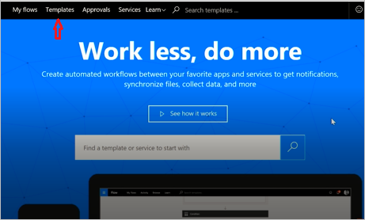
 
**Open** the **Templates** menu.

As you scroll through the list, you see that **Microsoft Flow** allows you to connect to many services.

 
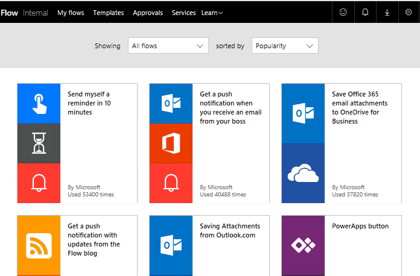

## Working with Templates

To highlight that, let’s go ahead and start with one of these templates that I think is useful.

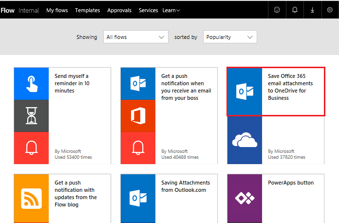

We are going to use this **template** that will put all of your email attachments into a folder in your OneDrive. I don’t know about you guys, but **searching for attachments** through email is a nightmare for me and this flow saves me time as I have one central location for all my incoming documents.

Click the **Save Office 365 email attachments to OneDrive for business** template.

## Create and Administer a Flow

This is one of our new – **one click** templates, where we try and only ask relevant questions necessary to **build** the flow without having you deal with the editor screens, which you haven’t seen yet.
Here, you can see a **detailed description** of what the template does and needs.

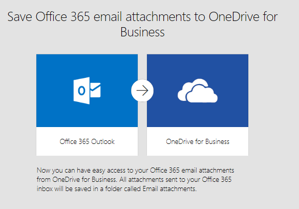

You are asked to **provide credentials** for the Office 365 Outlook and SharePoint services. 
If you use both services regularly, you will already be **signed into** them. 

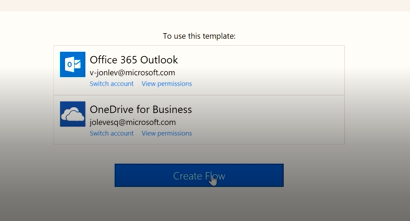

Click **Create Flow**, and Voila! 

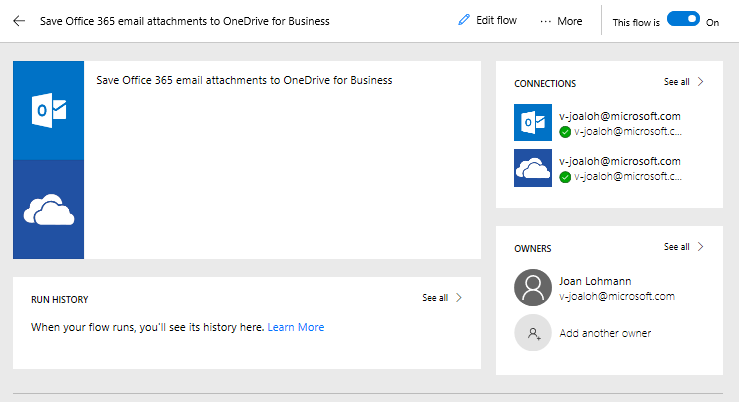

Flow has created a **folder** in my OneDrive where it will now automatically place every **attachment** that gets emailed to my work email.

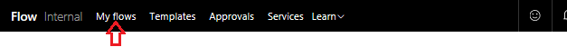

**Click My Flows**, and

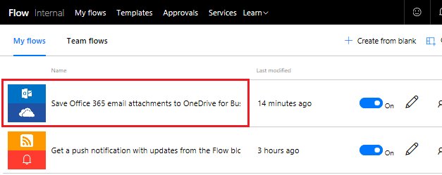

**click** the **flow** we just made to see how it works.

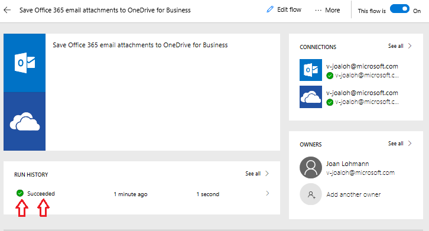

You see a message that the flow succeeded. 

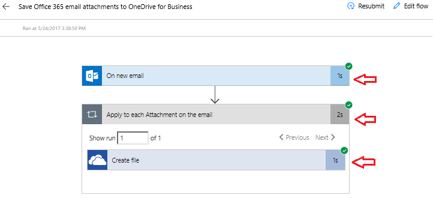

**Click Succeeded** to see the run history and the results are that **all parts** of the flow were successful.

## Important Concepts in Microsoft Flow

Some things to know about when building flows. 
Every flow has two key parts, a **trigger** and one or more **actions**. 
 
You can think of the **trigger** as the starting action for the flow, which can be things like **On new Email** that we have here or, when a **new item** is added, if you happened to be using SharePoint. It can also be a fixed schedule, if we use a trigger called **Recurrence** which we will discuss  later.

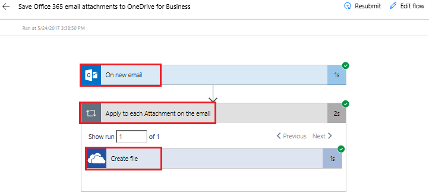

**Actions** are the activities you want to happen when a **trigger** is invoked. For example, **Create file** like we have here, to recreate the file in OneDrive. 

Other actions could be,  **send** an email, **post** a Tweet, start an **Approval** or many, many others.
These will all come into play later, as we build our own Flows from scratch. 

## Next Lesson

In our next lesson, we will look at the Microsoft Flow mobile app and its capabilities. 