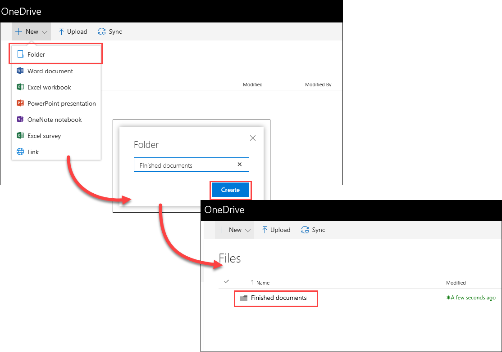
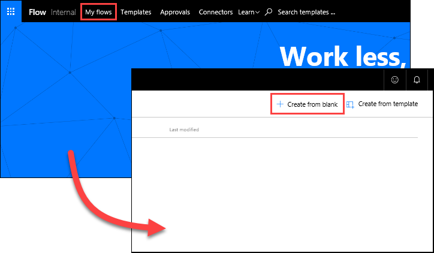
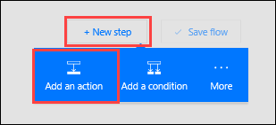
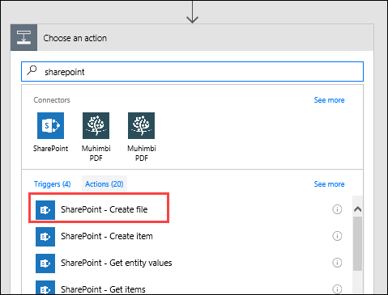
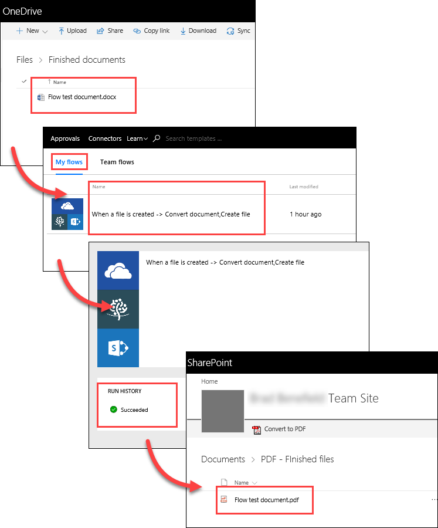

<properties
   pageTitle="Creating a Document Conversion Flow | Microsoft Flow"
   description="Creating a Document Conversion Flow in Microsoft Flow"
   services=""
   suite="flow"
   documentationCenter="na"
   authors="v-brbene"
   manager="anneta"
   editor=""
   tags=""
   featuredVideoId="ukRhuJGC9A0"
   courseDuration="4m"/>

<tags
   ms.service="flow"
   ms.devlang="na"
   ms.topic="get-started-article"
   ms.tgt_pltfrm="na"
   ms.workload="na"
   ms.date="08/16/2017"
   ms.author="v-brbene"/>

# Converting and Storing Documents using Microsoft Flow 

In this topic, you’ll see how Contoso Flooring uses Microsoft Flow to automatically convert documents to a standard format and then store them in SharePoint Online for safekeeping in the cloud. You'll create a flow that detects when a new file has been added to a OneDrive for Business folder, and then converts that file to PDF and stores it to a SharePoint Online folder. 

## Prerequisites

For this scenario, you’ll need an account with **Muhimbi**, a PDF conversion service. If you don’t have a Muhimbi account already, you can sign up for a [free 30-day trial](http://www.muhimbi.com/Products/PDF-Converter-for-SharePoint/Products-PDF-Converter-for-SharePoint-Free-Trial.aspx). Follow the instructions on that page for deploying the app through your SharePoint Online site. 

## Create the source and target folders
First, you need to create the source and target folders on OneDrive for Business and SharePoint Online. 

1. In OneDrive for Business, under **Files**, create a folder named **Finished Documents**. 

    

1. In SharePoint Online, in **Shared Documents**, create a folder named **PDF – Finished files**. 

    

## Create the flow

1. In Microsoft Flow, select **My Flows**, and select **Create from blank**. 

    

1. Select **Search hundreds of connectors and triggers**.

1. Search for **OneDrive**, select **OneDrive for Business**, and then select the trigger **OneDrive for Business - When a file is created**. In **Folder**, select the folder icon and select the **Finished Documents** folder that you created in the previous step. 

    

1. Select **New step**, and then select **Add an action**. 

    

1. Search for **Muhimbi**, select the **Muhimbi PDF** connector, and select the action **Muhimbi PDF – Convert document**.

    

1. At this point, you may be prompted by Microsoft Flow to authenticate to Muhimbi. You will need to register Muhimbi using your **SharePoint tenant ID** in order for Microsoft Flow to use the Muhimbi service. 

    1. To find your tenant ID, select the **Settings** gear icon in SharePoint Online, and select **Site settings**.
    
    1. Under **Site Collection Administration**, select **Site collection app permissions**. Your tenant ID is the identifier that follows the “**@**” symbol in any of the app listings. 

        

1. In the **Convert document** action, set the following values:
    - **Source file name**: From the dynamic content list, select **File name**.
    - **Source file content**: From the dynamic content list, select **File content**.
    - **Output format**: From the dropdown, select **PDF**.

    

So far, you’ve configured your flow with the following steps: 

1. The flow is triggered whenever a new file is added to a specific OneDrive for Business folder 
1. The Muhimbi service converts that file to PDF. 

For the final step, you’ll add an action that will move the PDF document to a SharePoint Online folder where the team can access it.  

1. Select **New step**, and then select **Add an action**.  Search for **SharePoint**, and select the **SharePoint – Create file** action. 

    

1. In the **Create file** action, set the following values:
    - **Site address**: The URL of your SharePoint site.  
    - **Folder path**: Select the folder icon and navigate to the **PDF - Finished files** folder.
    - **File name**: From the dynamic content list for **Convert document**, select **Base file name**, then add “**.pdf**” so it will be saved in SharePoint with the file extension. 
    - **File content**: From the dynamic content list for **Convert document**, select **Processed file content**.

1. Select **Create flow** at the top of the page to save your work.

    

## Test the flow

1. To test the flow, add a new file to your **Finished Documents** folder in OneDrive for Business. 

1. In Flow, select **My flows**, and then select the new flow to view the run history. By default, the flow is configured  to run every five minutes. 

1. After the flow runs, verify that the file was converted to PDF and saved to the SharePoint **PDF – Finished files** folder. 

    