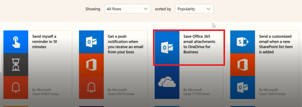
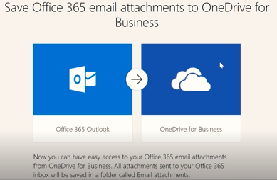
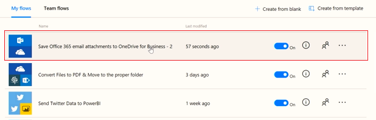

<properties
   pageTitle="Create a Flow from a Template | Microsoft Flow"
   description="Create a Flow from a list of templates, manage, and administer the flow ."
   services=""
   suite="flow"
   documentationCenter="na"
   authors="v-joaloh"
   manager="anneta"
   editor=""
   tags=""
   featuredVideoId="kZs7lqgp4LU"
   courseDuration="5m"/>

<tags
   ms.service="flow"
   ms.devlang="na"
   ms.topic="create-a-flow-article"
   ms.tgt_pltfrm="na"
   ms.workload="na"
   ms.date="05/11/2017"
   ms.author="v-joaloh"/>

# Guided Learning for Microsoft Flow

Welcome back to **Guided Learning** for Microsoft Flow. In this session, we will start to show you some more of the Microsoft Flow environment, and introduce you to building your first Flow.

Getting started with **Flow** is easy, as we have a HUGE number of templates for you to choose from which will help you connect the services you are already using in more meaningful ways.  

## Flow Website for Templates
Let’s jump onto the flow website and take a look.

Open the **Templates** menu.

As you scroll through the list, you see that Flow allows you to connect to a multitude of services.

 

## Working with Templates

To highlight that, let’s go ahead and start with one of these templates that I think is useful.

We are going to use this template that will put all my email attachments into a folder in my OneDrive. I don’t know about you guys, but searching for attachments through email is a nightmare for me and this Flow saves me time as I have one central location for all my incoming documents.

2. I click the **Save Office 365 email attachments to OneDrive for business** template.

## Creating and Administering a Flow

This is one of our new – **one click** templates, where we try and only ask relevant questions necessary to build the Flow without having you deal with the editor screens, which you haven’t seen yet.
Here, you can see a detailed description of what the template does and needs.

3. I am asked to provide credentials for the Office 365 Outlook and SharePoint services. 
4. Since I use both services regularly, am already signed into them. 

5. I click Create Flow, and Voila! 

Flow has created a folder in my OneDrive where it will now automatically place every attachment that gets emailed to my work email.

6. I click the Flow we just made to see how it works.

## In Flow Designer

Some things to know about when building Flows. 
Every Flow has two key parts, a **trigger** and one or more **actions**. 
 
You can think of the **trigger** as the starting action for the flow, which can be things like **On new Email** like we have here… or When a **new item** is added if you happened to be using SharePoint. It can also be a fixed schedule if we use a trigger called **Recurrence** which we will discuss  later.

**Actions** are the activities you want to happen when a **trigger** is invoked. For example, **Create file** like we have here, to recreate the file in OneDrive. 

Other actions could be, send an email, post a Tweet, Start an **Approval** or many, many others.
These will all come into play later, as we build our own Flows from scratch. 

## Next Session

In our next session, we will look at the Flow mobile app and its capabilities. 