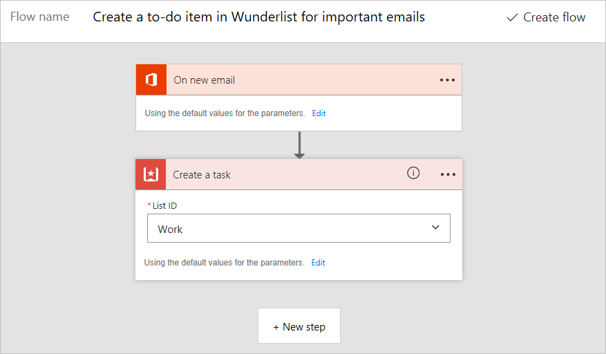
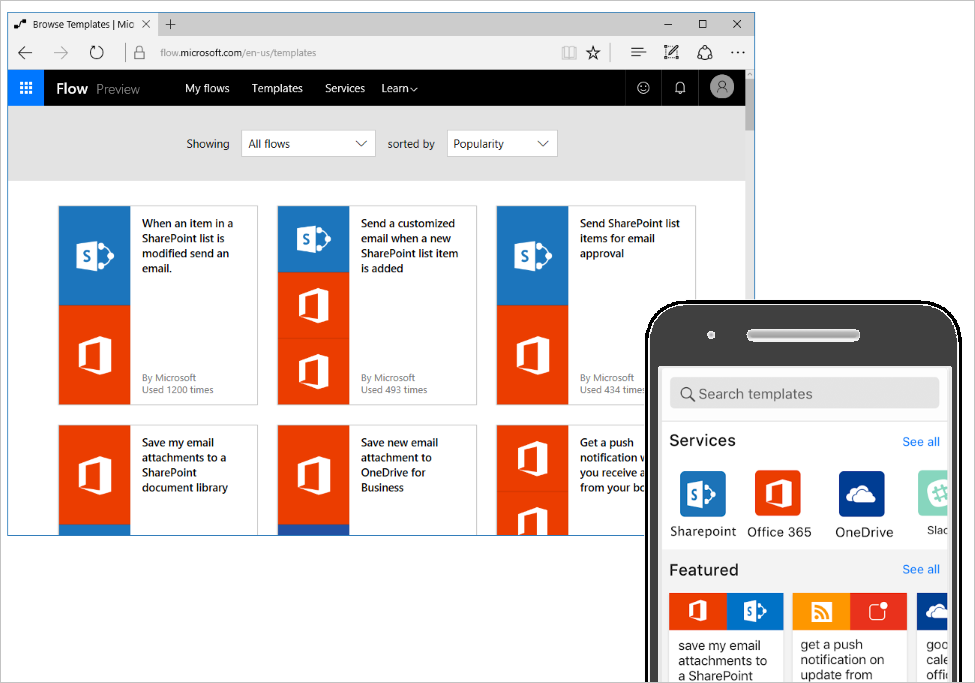
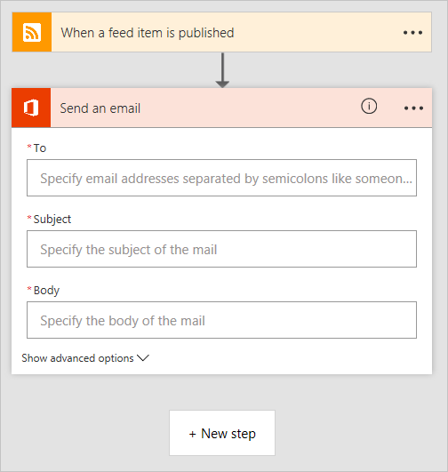
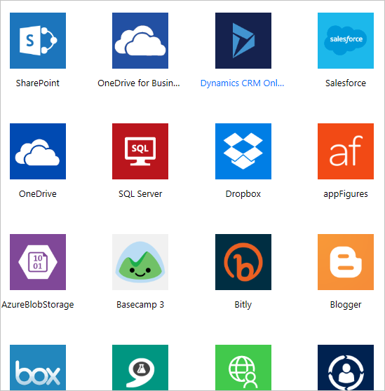
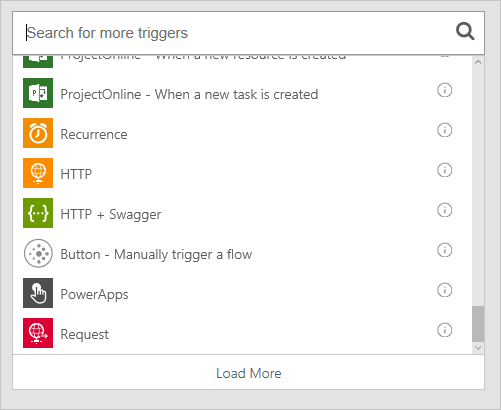
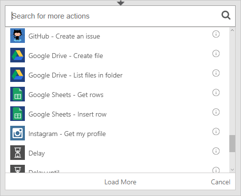

<properties
   pageTitle="Building blocks of Microsoft Flow | Microsoft Flow"
   description="See the different parts of Microsoft Flow and how they relate. Create new flows from templates and from scratch."
   services=""
   suite="flow"
   documentationCenter="na"
   authors="msftman"
   manager="anneta"
   editor=""
   tags=""
   featuredVideoId="9U8jMRO-Jv0"
   courseDuration="9m"/>

<tags
   ms.service="flow"
   ms.devlang="na"
   ms.topic="get-started-article"
   ms.tgt_pltfrm="na"
   ms.workload="na"
   ms.date="11/22/2016"
   ms.author="deonhe"/>

# Building blocks of Microsoft Flow

Now that you know the basics of Microsoft Flow, let's jump into **a tour of Microsoft Flow**. We'll quickly look at creating flows from templates and creating flows from scratch.

## Check out the templates

At flow.microsoft.com, if you click the **Templates** link on the top of the page, you'll be greeted with several templates you can use right away with your web services. Explore these apps to **get a quick sense of what's possible** and how Microsoft Flow can help your business.

Each template flow is designed for a specific purpose, such as receiving notifications when something happens, copying a new file from one service to another, or tracking SharePoint approvals. These templates are **ready to be used**.  You just have to **configure the templates** to add flows to your account. You do this by clicking **Use this template**, signing into the required services, and then completing the forms that follow.  For example, this is a flow created from a template to send email notifications when a SharePoint list is modified. 

There are hundreds of templates avaiable, and you can find them in **Microsoft Flow for web** or **Microsoft Flow for mobile**.

## Create a flow from scratch

You've seen how to create a flow using a template, but what if there's a task you want to automate but you can't find an appropriate template? You can **build a flow from scratch**.  When you create a flow from scratch, you start from a blank canvas and add **services, triggers, and actions** to build your flow.  

## Building blocks of a flow

Whether you're building a flow from a template or from scratch, your flows will contain **building blocks** that work together in certain ways, much like a flowchart.

- **Services** are sources and destinations of data in a flow.
- **Triggers** are events that start a flow.
- **Actions** are tasks accomplished by the flow.
- **Conditions** allow for branching if/then logic in a flow.
- **Loops** are for iterating over actions more than once.

### Services

Microsoft flow can connect to many different **applications and services**.  Some example services are **Twitter**, **Github**, **Wunderlist**, **Office 365**, and **Google Docs**.  These are the **sources** that provide data to Microsoft Flow as well as providing **destinations** for the work done by Microsoft Flow.  You can view the entire list of services by clicking the **Services** link at the top of **flow.microsoft.com**.

### Triggers

Every flow starts with a **trigger**.  There are many different types of triggers.  Some of them are events in your connected web services, such as **when a certain user sends a tweet** or **a file is saved to your Dropbox account**.  Other triggers are built-in, such as **running a flow on a recurring schedule** or **running a flow in response to a web request**.  Finally, there are manual triggers, such as launching a flow by clicking a **button in Microsoft Flow or Microsoft PowerApps**.  Triggers often **pass information about the event that happened** to actions in your flow.

  

### Actions

An **action** represents what you want to actually **happen** after the flow is triggered.  This might be a **notification**, **copying data or files** from a source to a destination, or some other action, like **posting to social media** or **delaying for a period of time**.  You can also use actions to **retrieve data from a service** to use with other actions.

 

### Conditions

**Conditions** allow you to add decision making to your flow.  When a condition is evaluated, the flow branches into a **yes** path and a **no** path.   For example, If you wanted to copy your vacation photos posted to **Dropbox** to **OneDrive**, you might create a condition after a **Dropbox new file** trigger that checks to see if the file name contains the word *vacation*, and if it does, copy the file to **OneDrive**, but otherwise chooses to do nothing.

 

### Loops

**Loops** allow you to execute an action more than once, like if an action needs to occur repeatedly, or once per item in a collection of items.

## Next lesson

In this topic, we took a look around Microsoft Flow.  We browsed **templates**, and we talked about **creating a flow from scratch**.  We build flows by connecting to apps and services, **triggers** to launch the flow, **actions** to make something happen in the flow, **conditions** to make decisions, and **loops** to iterate in a flow.  **The easiest way to learn about Microsoft Flow is to start with a template** and connect it to apps and services you already use. 

Next, we'll review what we've learned so far in this Guided Learning course.

