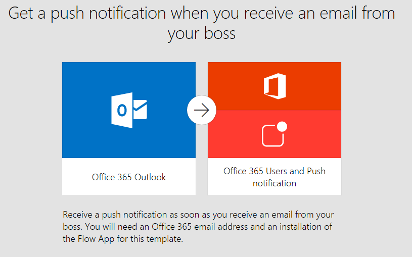
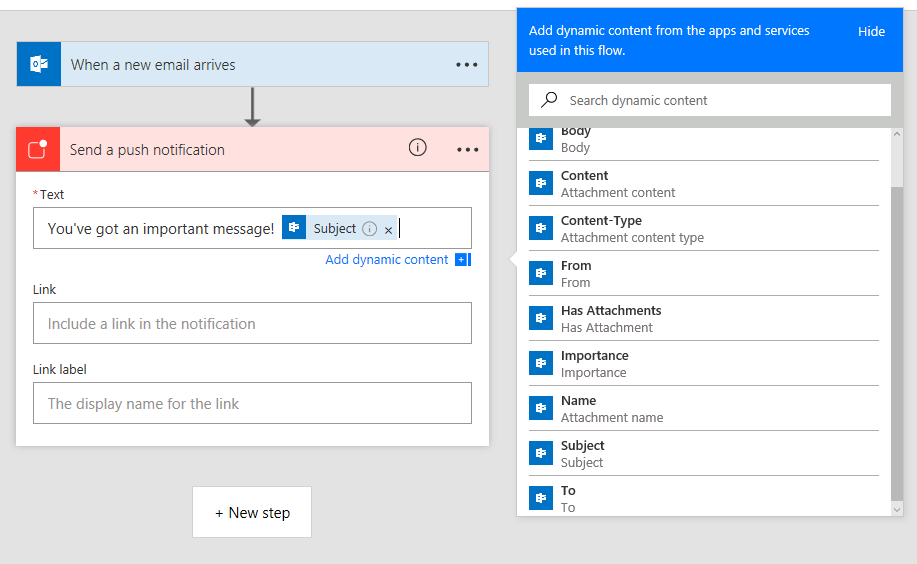

# Get notifications from a flow
A common use of **Microsoft Flow** is to get a **notification** when something happens.  Notifications can be **emails**, **text messages**, or **push notifications on your phone**.

## Required app
It's easy to create a flow that sends push notifications to your **mobile device**.  You can create the flow in the **mobile app** or at **flow.microsoft.com**, but you'll need the **mobile app** to receive push notifications. The Microsoft Flow mobile app is available for [Android](https://aka.ms/flowmobiledocsandroid), [iOS](https://aka.ms/flowmobiledocsios), and [Windows Phone](https://aka.ms/flowmobilewindows).

If you are using an unsupported mobile device, consider using **SMS messages** (texts) to receive notifications instead of push notifications.

## Creating flows that send notifications
You can **use a template**, like in the video above, or you can use the *Send a push notification* **action** when creating a flow **from scratch**.  You can include **dynamic content** from other actions or triggers.

## Next lesson
Now that you've seen how to **receive notifications**, let's look at using Microsoft Flow to **copy files**.

