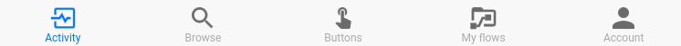
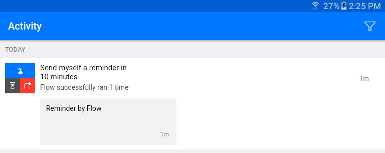
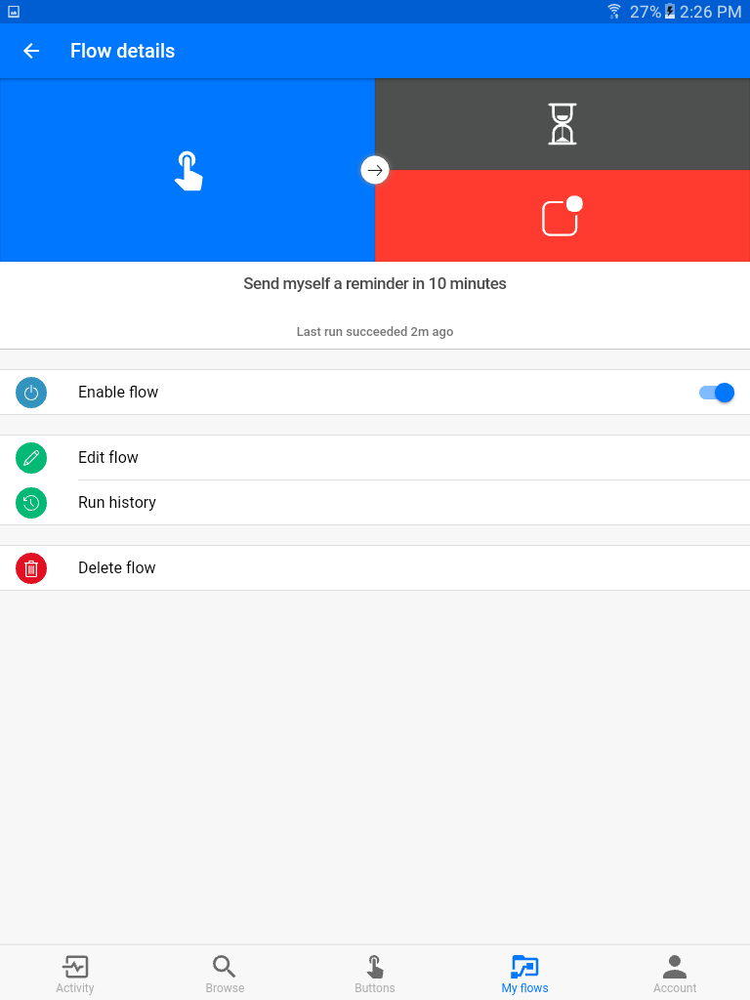

<properties
   pageTitle="Manage Flows in the Microsoft Flow Mobile App | Microsoft Flow"
   description="Learn how to use the Microsoft Flow mobile app to manage your flows."
   services=""
   suite="flow"
   documentationCenter="na"
   authors="msftman"
   manager="anneta"
   editor=""
   tags=""
   featuredVideoId="cKJ9twiM64o"
   courseDuration="6m"/>

<tags
   ms.service="flow"
   ms.devlang="na"
   ms.topic="get-started-article"
   ms.tgt_pltfrm="na"
   ms.workload="na"
   ms.date="11/22/2016"
   ms.author="deonhe"/>

# Manage flows with the mobile app

The **Microsoft Flow** mobile app, available for iOS and Android (Windows coming soon), has much of the same functionality as the web portal.

At the bottom of the screen is a **toolbar** where you'll find the app's functions.

## Activity

The **Activity** screen displays all the activity of your flows, including **run history** and **notifications**.

Touching a **run history** entry will drill down to a **detailed log** where you can see which steps in the flow **succeeded or failed**.  Clicking on a step in this log will show **debug information** that may be useful in **troubleshooting** a flow that isn't behaving as expected.

## Browse

The **Browse** screen gives you an interface to **search** or **browse** for flow **templates**.  Touching a template will present a dialog to complete the template and create a new flow. 

## Buttons

The **Buttons** screen is where you can trigger any flows that contain a **Button - Manually trigger a flow** trigger.

## My flows

The **My flows** screen lists all your flows.  Touching a flow takes you to the **Flow details** screen.

The **Enable flow** toggle switch allows you disable/enable a flow without deleting it.

Touching **Edit flow** takes you to the flow designer to edit your flow.

Touching **Run history** displays the **run history** for the flow, same as on the **Activity** screen.

Touching **Delete flow** deletes the flow.  Once deleted, a flow cannot be recovered.

## Account

The **Account** screen allows you to **sign out** of the mobile app, as well as change your current **environment**.  You can also find information about the app and **support** options.

## Next lesson

We've looked at two ways to **manage Microsoft Flow**.  Next, we'll review what we learned in this section.

