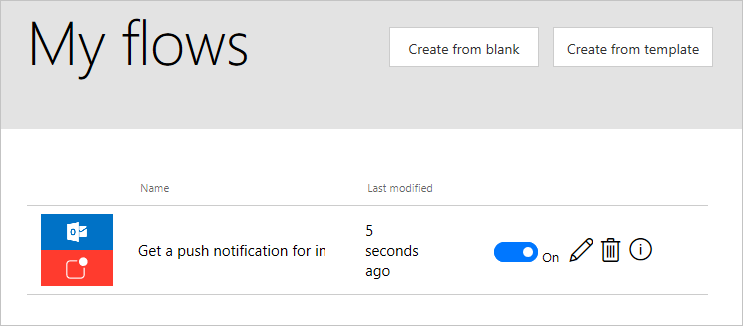
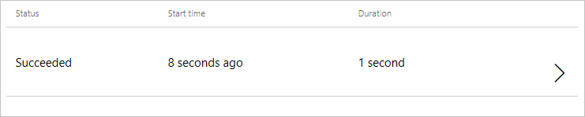
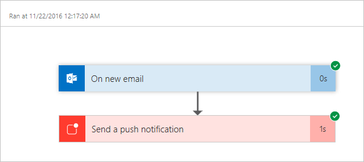

<properties
   pageTitle="Manage Flows in the Microsoft Flow Portal | Microsoft Flow"
   description="Learn how to use the Microsoft Flow web portal to manage your flows."
   services=""
   suite="flow"
   documentationCenter="na"
   authors="camsoper"
   manager="anneta"
   editor=""
   tags=""
   featuredVideoId="Mg67quraCYs"
   courseDuration="3m"/>

<tags
   ms.service="flow"
   ms.devlang="na"
   ms.topic="get-started-article"
   ms.tgt_pltfrm="na"
   ms.workload="na"
   ms.date="11/22/2016"
   ms.author="casoper"/>

# Manage flows with the web portal

The **Microsoft Flow** web portal located at **flow.microsoft.com** provides everything you need to administer your flows in a **web browser**.  The portal will work both with **desktop** and **mobile** browsers, but for the best **mobile experience**, you may want to use the **mobile app**.

## Getting to the web portal

If you browse to **flow.microsoft.com** and sign in, you can view your list of flows by clicking **My flows** at the top of the page.

## Managing flows

To the right of your flow's name and last modified time, you'll see some a **toggle switch** and some **icons**.

The **toggle switch** allows you disable/enable a flow without deleting it.

Clicking the **pencil icon** takes you to the flow designer to edit your flow.

The **trash icon** deletes the flow.  Once deleted, a flow cannot be recovered.

Finally, the **information icon** displays the **run history** for the flow.  In the **run history**, you will find a log of **every time the flow has run**, as well as whether it was **successful**. 

Clicking a history item will drill down to a **detailed log** where you can see which steps in the flow **succeeded or failed**.  Clicking on a step in this log will show **debug information** that may be useful in **troubleshooting** a flow that isn't behaving as expected.

## Next lesson

Now that we've learned about the **Microsoft Flow web portal**, let's see how we can manage our flows with the **mobile app**.

