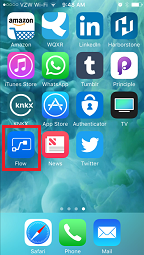
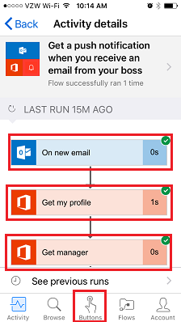
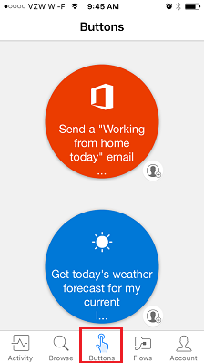

<properties
   pageTitle="Mobile App | Microsoft Flow"
   description="How to use the mobile app for Microsoft Flow to create and manage flows."
   services=""
   suite="flow"
   documentationCenter="na"
   authors="v-joaloh"
   manager="anneta"
   editor=""
   tags=""
   featuredVideoId="kZs7lqgp4LU"
   courseDuration="5m"/>

<tags
   ms.service="flow"
   ms.devlang="na"
   ms.topic="get-started-article"
   ms.tgt_pltfrm="na"
   ms.workload="na"
   ms.date="06/07/2017"
   ms.author="v-joaloh"/>

# Guided Learning for the mobile app for Microsoft Flow

In this lesson, we will be covering the Flow Mobile App and its capabilities. We will go over The **Activity Feed**, **Browsing**, **Buttons** and **Managing Flows** from the app.

First, you’ll need to **download** and **install** the Microsoft Flow App from your app store.

Once it's installed, **open it** up and **sign in**.

As we can see here, when you open the app, you land on the **Activity Feed**.

The Activity Feed is the spot to see what’s happening with your flows while you are on the go and may not have access to your computer for a full experience.

For instance, if you **click** any of these flows, you can get a **closer look** at that flows **last activity**, whether it succeeded or failed to run, and if it failed, which step it failed on.

As we can see here, this flow succeded in all three steps.
From here, go ahead and **click** the **Buttons** icon.

## How Flows are Kicked Off
   
   Buttons are flows that are kicked off with a manual action. For instance, one of my buttons is **Send a Working from Home email to your Manager**.
   You could use this one if you live far away and on days the traffic is a mess!

Use the **Browse** button to check out templates for more button flows to add to your collection. 

Let’s go ahead and see how that works.

**Choose** the **Send myself a reminder in 10 minutes** button flow.

And then, click **Use this template**.

and then click on **Create**.

The flow is **saved**, 

**created**, 

and here it is in your collection.

Here it is in your buttons, and you can go ahead and **click it**, and in 10 minutes, you'll get a **reminder**.

See how simple it is to **add additional buttons** to your collection?
Now, what if you suddenly decide that you don’t want one of your Flows anymore?

**Click** on the **Flows** button which is essentially the mobile management area for your flows.

Now, **click** on this **flow** as you don’t really want this one anymore and we see that you have a few options.

You can enable it or disable it by **pressing the Enable flow** toggle, and you can also delete it by **pressing the Delete** button.

You can **enable** or **disable** the flow on the go, you can edit the flow, in case you want to make it useful to yourself again, and you can see the **run history** of the flow to get an idea of its successful and unsuccessful runs.

## Next Lesson

In our next lesson, we will look at the **Create a Button** flow. 