<properties
   pageTitle="Microsoft Flow Mobile App | Microsoft Flow"
   description="How to use the Microsoft Flow mobile app to create and manage flows."
   services=""
   suite="flow"
   documentationCenter="na"
   authors="v-joaloh"
   manager="anneta"
   editor=""
   tags=""
   featuredVideoId="kZs7lqgp4LU"
   courseDuration="5m"/>

<tags
   ms.service="flow"
   ms.devlang="na"
   ms.topic="get-started-article"
   ms.tgt_pltfrm="na"
   ms.workload="na"
   ms.date="06/07/2017"
   ms.author="v-joaloh"/>

## Guided Learning for the Microsoft Flow Mobile app ##

In this lesson, we will be covering the Microsoft Flow Mobile App and its capabilities. We will go over The **Activity Feed**, **Browsing**, **Buttons** and **Managing Flows** from the app.

First, you’ll need to **download** and **install** the Microsoft Flow App from your app store.

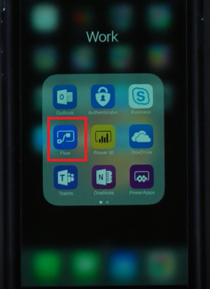

Once it's installed, **open it** and **sign in**.

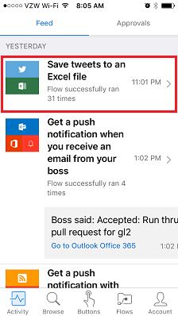

As we can see, when you open the app, you land on the **Activity Feed**.

The Activity Feed is the spot to see what’s happening with your flows **while you are on the go** and may not have **access to your computer** for a full experience.

For instance, if you click any of these flows, you can **get a closer look** at that flows **last activity**, whether it succeeded or failed to run, and if it failed, which step it failed on.

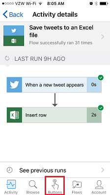

As we can see, this flow succeded in both steps.
From here, go ahead and click the **Buttons** icon.

## How Flows are Kicked Off ##
   
   Buttons are flows that are started with a manual action. One of my buttons is **Send a Working from Home email to your Manager**.
   You could use this one if you live far away and on days the traffic is a mess!

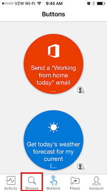

Use the **Browse** button to check out templates for **more button flows to add** to your collection. 

Let’s go ahead and see how that works.

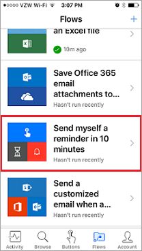

Choose the **Send myself a reminder in 10 minutes** button flow.

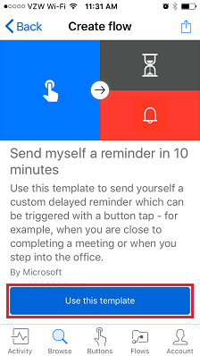

Click **Use this template**,

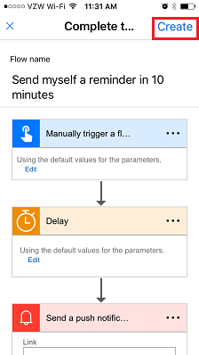

and click **Create**.

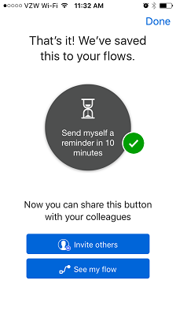

The flow is **saved**, **created**, 

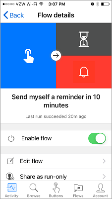

and **here it is in your collection**.

**Here it is in your buttons**,

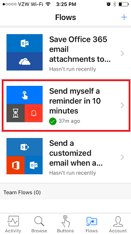

 and you can **go ahead and click it**, and in 10 minutes, you'll **get a reminder**.

See how simple it is to **add additional buttons** to your collection?
Now, what if you suddenly decide that you don’t want one of your flows anymore?

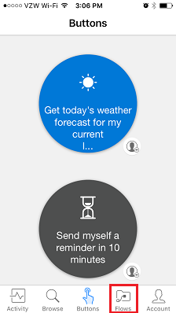

Click the **Flows** button, which is essentially the **mobile management area** for your flows.

Now, click on this flow as you don’t really want this one anymore, and we see that you have a few options.

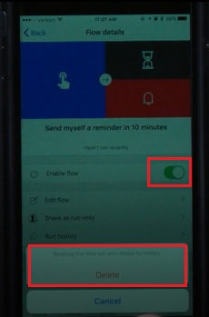

To enable or disable the flow, **press the Enable flow** toggle. You can also delete it by **pressing the Delete flow** button.

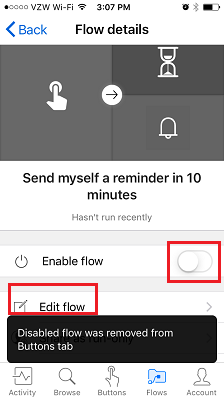

You can see the **run history** of the flow, to get an idea of its **successful and unsuccessful runs**. And you can always **edit the flow**, in case you want to **make it useful** to yourself again.

## Next Lesson ##

In our next lesson, we will look at how to **create a  button flow for a team**. 