<properties
   pageTitle="Push notifications in Microsoft Flow | Microsoft Flow"
   description="Create push notifications from SharePoint to Twitter using Microsoft Flow."
   services=""
   suite="flow"
   documentationCenter="na"
   authors="v-joaloh"
   manager="anneta"
   editor=""
   tags=""
   featuredVideoId="kZs7lqgp4LU"
   courseDuration="5m"/>

<tags
   ms.service="flow"
   ms.devlang="na"
   ms.topic="get-started-article"
   ms.tgt_pltfrm="na"
   ms.workload="na"
   ms.date="06/20/2016"
   ms.author="v-joaloh"/>

# Create Push Notifications in Microsoft Flow #

This session of **Guided Learning** for Microsoft Flow will teach you how to create push notifications. For this flow, you'll build a **SharePoint** list where the Marketing team for **Contoso Flooring** will store their **Twitter posts** and posting dates. From there, you will build a flow that will auto-Tweet the content for them. 

## Connect Microsoft Flow Services

If you are using a service that's new to you, then you'll need to connect the new service. 

In this lesson, you'll be using the **SharePoint** and **Twitter** services.

In Microsoft Flow, select the **Gear icon**, and **Connections**,

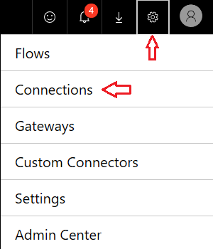 

and **+ Create connection**.

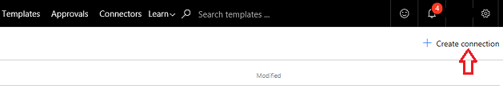 

Scroll down the list, **find Twitter**, and select **the +** 

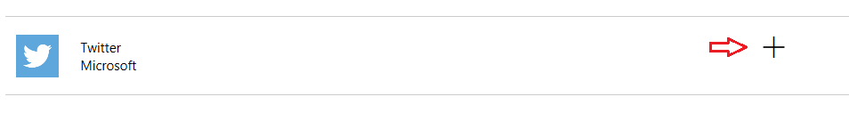

To authorize a Twitter account, enter **your Username or email**, **your password** and select **Authorize app**.

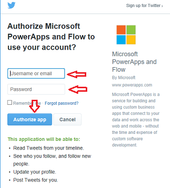

To check your connections,  select the **gear icon** > **Connections** and ... 

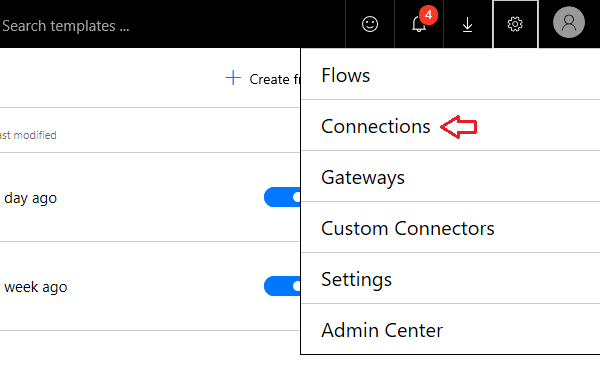

You should see a list of **your connections with Twitter** there. 

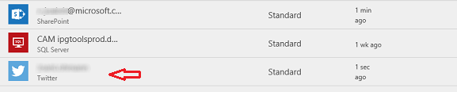

## Build a SharePoint List ##

Use the SharePoint service to build a list for Contoso.

The first thing you need to do is create a new SharePoint list. 

Select **New**, and then **List**.

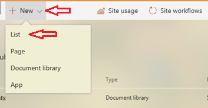

Go ahead and name it **Contoso Tweets**. 

Clear the **Show in site navigation** check box, and press **Create**.
 

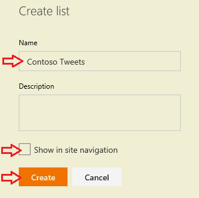

When you press Create, SharePoint drops you into your new list.

By default you are given **one column with title**.

Add another column and name it **Tweet Contents**. The things that you’ll say in the tweets will go here. 

Press the plus sign and move down to **More Column Types...**

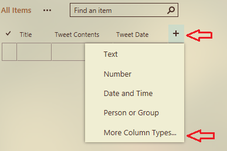

There, check **Multiple lines of text**. 

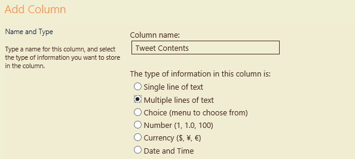

Add a column for the tweet **Date and Time**, and name it **Tweet Date**.

As with **Tweet Contents** above, press the plus sign and move down to **More Column Types...**

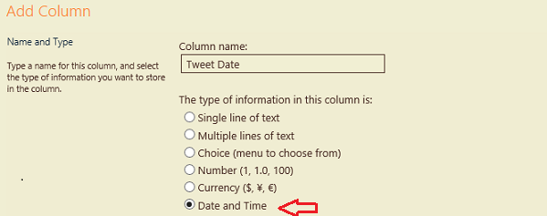

**Important!** Scroll down to **Date and Time Format:**, you want to select **Date & Time**, so that both are included.

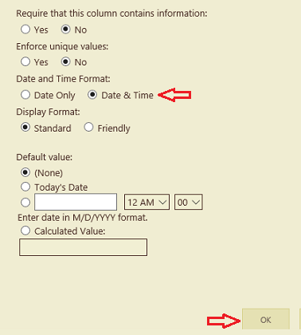

Click **OK**.

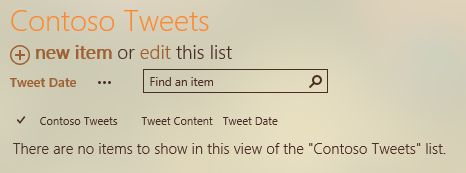

You see the **Contoso Tweets** list in your SharePoint site, and you can add new items or edit the list.

## Build the flow ##

Your list is built, so now you can build the flow.

In Microsoft Flow, go to **My Flows**, and press **Create from blank**.

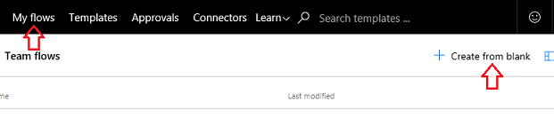

Make the trigger a SharePoint list – click the **SharePoint connector**.

If its not there in your list, type **SharePoint** in the search bar to bring up the connector.

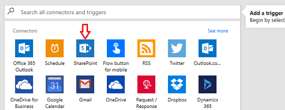

## Choose a trigger ##
In the list, select **SharePoint - When a new item is created**. 

We want our trigger to be when a **new row is added** with Tweet content, the **flow checks for it** automatically.

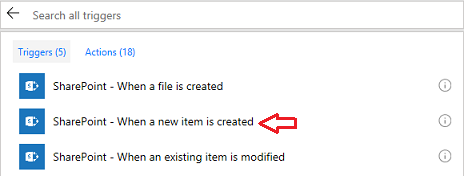

Pick your SharePoint site -- If it **won’t load**  for you --  **enter a part** of the address, and click **OK**. 

You can see the list that you set up earlier, **Contoso Tweets**.

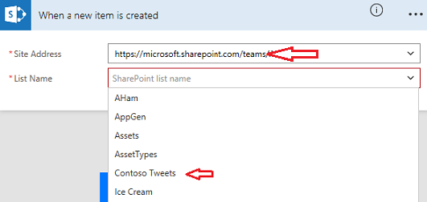

Okay, that’s it – the trigger is done.

 ## Choose a new action ##

Select **+ New step**, and **Add an action**. 

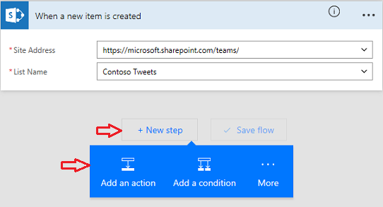

Click, **Delay until**. 

You'll see, it lives under the Schedule service, and the action itself is called Delay until.

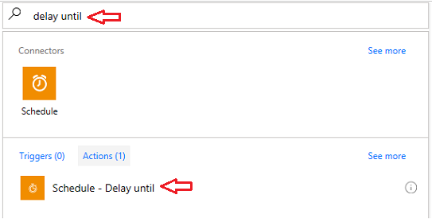  

When the dynamic content pops up, scroll down to the bottom, and you see that there are the three columns you set up in the list, Title,  Tweet Date, and Tweet Content. Use the dynamic content of **Tweet Date** for the **Delay until** schedule. 

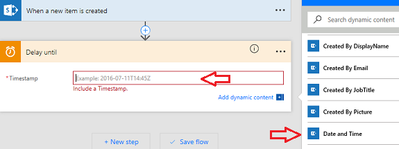

Now, when someone **adds something** to your SharePoint list, it will **delay any action** until the Date and Time you set in the **Tweet Date** column.

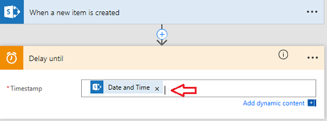 

Add **another action** for the flow to take **at the date and time** you have it delayed until.

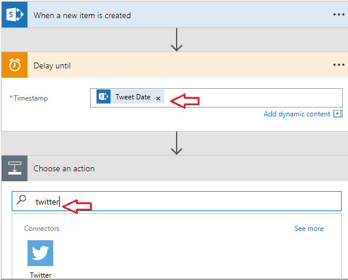 

Now, you'll add a final step which will use the Twitter service.

Choose the action, **Twitter - Post a tweet**.

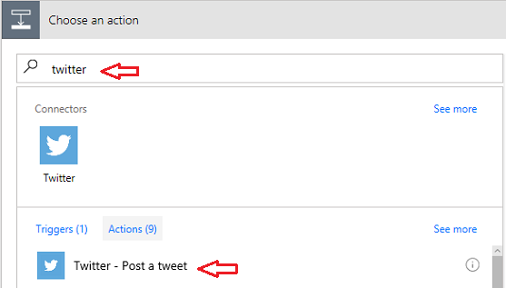 
Open the dynamic content again, and select **Tweet Content**. 

Here's the sequence you have created. 

When a **new item is created** in your SharePoint list, you will **delay it until** the pre-set date, and once that date is met, you'll **post it** with the Tweet Content column that you previously set up.

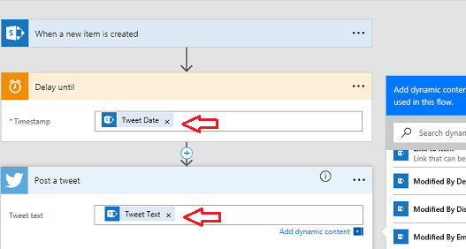

Select **Create flow...**

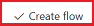 

Click **Done**,

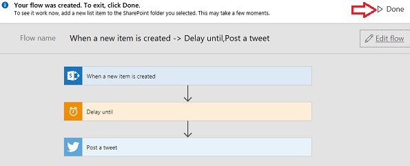

and the flow is done.

## Next lesson ##

In the next lesson, you'll learn how to **run flows on a schedule** using a trigger called **Recurrence**. You'll also create a sample flow for the Contoso Flooring Marketing team.