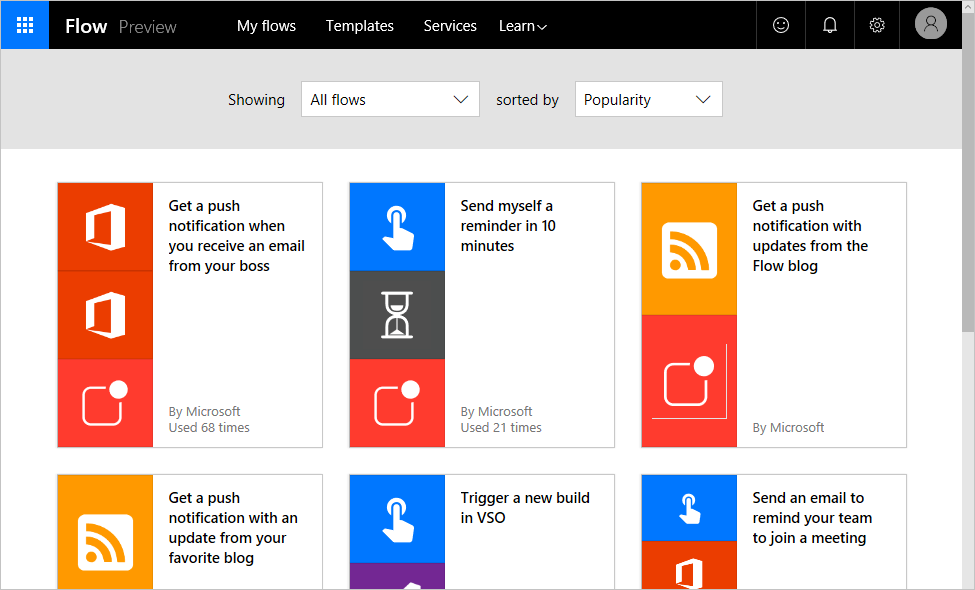
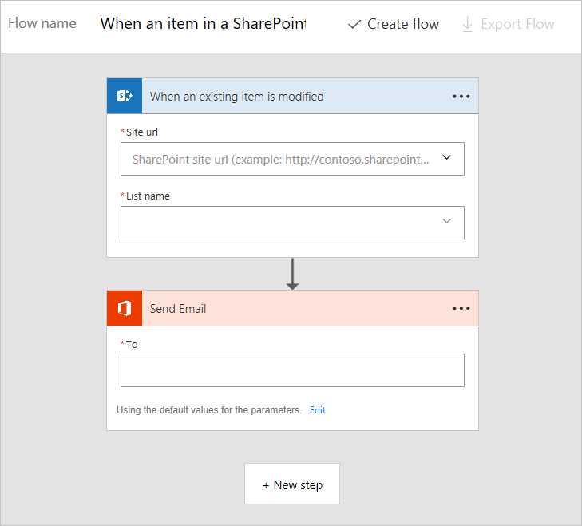
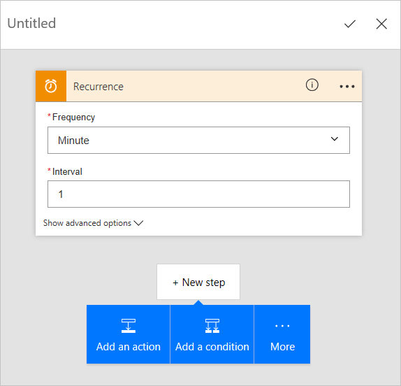

<properties
   pageTitle="A quick look at creating flows | Microsoft Flow"
   description="Look at the different ways you can create flows"
   services=""
   suite="flow"
   documentationCenter="na"
   authors="camsoper"
   manager="anneta"
   editor=""
   tags=""
   featuredVideoId=""
   courseDuration="5m"/>

<tags
   ms.service="flow"
   ms.devlang="na"
   ms.topic="get-started-article"
   ms.tgt_pltfrm="na"
   ms.workload="na"
   ms.date="10/24/2016"
   ms.author="casoper"/>

# A quick look at creating flows in Microsoft Flow

Now that you know the basics of Microsoft Flow, let's jump into **a tour of how to create flows**. We'll quickly look at creating flows from templates and creating flows from scratch. In the next topic, we will get more hands-on with flow creation.

## Check out the templates

At flow.microsoft.com, if you click the **Templates** link on the top of the page, you'll be greeted with several templates you can use right away with your web services. Explore these apps to **get a quick sense of what's possible** and how Microsoft Flow can help your business.

Each template app is designed for a specific purpose, such as receiving notifications when something happens, copying a new file from one service to another, or tracking SharePoint approvals. These templates are **ready to be used.**  You just have to **configure the templates** to add flows to your account. You do this by clicking **Use this template**, signing into the required services, and then completing the forms that follow.  For example, this is a flow, created from a template, to send email notifications when a SharePoint list is modified. 

There are hundreds of templates avaiable, and you can find them in **Microsoft Flow for web** or **Microsoft Flow for mobile**.

## Create a flow from scratch

You've seen how to create a flow using a template, but what if there's a task you want to automate but you can't find an appropriate template? You can **build a flow from scratch**.  When you create a flow from scratch, you start from a blank canvas and add **connectors, triggers, and actions** to build your flow.  

**The easiest way to learn about Microsoft Flow is to start with a template** and connect it to services you already use.  Then you can branch out and let your creativity take over!  In the next topic, you will learn the building blocks of Flow.