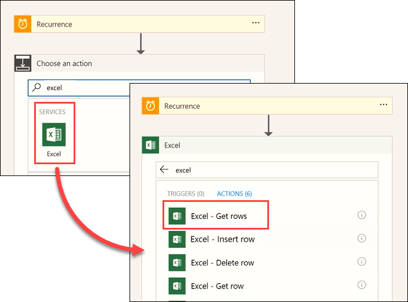
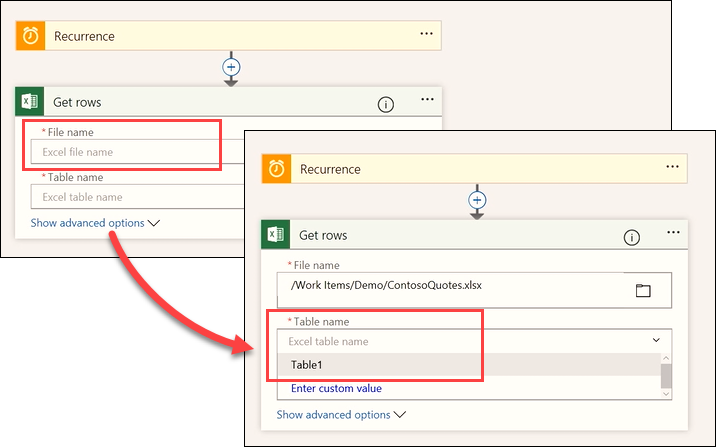
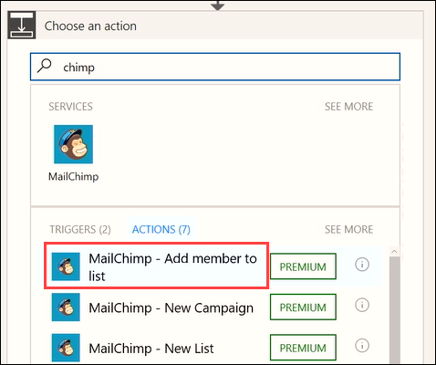
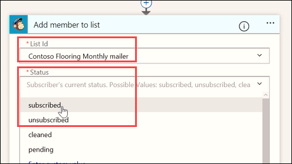
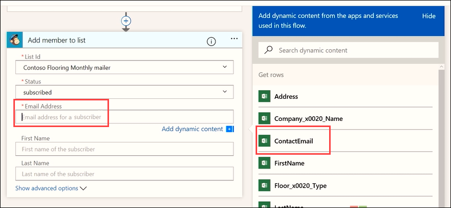
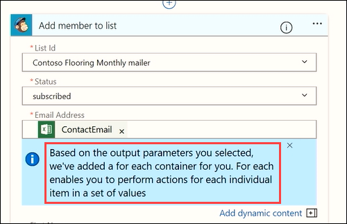

<properties
   pageTitle="Using Scheduled Flows | Microsoft Flow"
   description="Creating a scheduled flow in Microsoft Flow"
   services=""
   suite="flow"
   documentationCenter="na"
   authors="v-brbene"
   manager="anneta"
   editor=""
   tags=""
   featuredVideoId="os33pHQ9jSU"
   courseDuration="4m"/>

<tags
   ms.service="flow"
   ms.devlang="na"
   ms.topic="get-started-article"
   ms.tgt_pltfrm="na"
   ms.workload="na"
   ms.date="6/26/2017"
   ms.author="v-brbene"/>

# Using Scheduled Flows in Microsoft Flow 
In previous videos, you saw how to use templates, how to build a flow from scratch for the Contoso Flooring twitter account, and then, how to build an approval process on top of that to process your team’s Twitter inputs. In this next video, you’ll see how to run pre-scheduled flows using a trigger called **recurrence**.  You’ll build a flow for the Contoso marketing team that automatically pulls customer email addresses from an Excel table on OneDrive. You’ll configure the flow so that once per day, new email addresses that were added to the spreadsheet are then added to a MailChimp customer list. 

## Create a scheduled flow
Open **Microsoft Flow**, click **My flows**, and then click **Create from blank**. 

Search for the **Schedule** service, select it, and then select the **Schedule – Recurrence** trigger.

Set **Frequency** to **Day**, and **Interval** to **1**. Click **New step**, and select **Add an action**. 

Search for **Excel**, select the **Excel** service, and select the action **Excel – Get Rows**. 

**Note**: Be sure to select **Get Rows**, not **Get Row**. 

Click **File name** and navigate to your file location. Click **Table name** and select the desired table in the spreadsheet. 

Add a new action. 

Search for the **MailChimp** service, then select the action **MailChimp - Add member to list**.

Add the **List Id** and **Status** fields from the dropdown menus:
- **List Id** – Select your desired MailChimp mailing list
- **Status** – Select **Subscribed** 

In **Email Address**, use the dynamic content feature to add the **ContactEmail** field. 

Notice that the flow automatically creates an additional step. Flow detects that you are going to set an action that requires an additional action. Whenever the flow reads a new email address, it will also create a new action for each row. 

Use dynamic content to fill in the **First name** and **Last name** fields:
- **First name** – FirstName
- **Last name** – LastName

Now this flow will run once a day and get new rows from this Excel table, grab the email address and name, and use them to populate the MailChimp Contoso mail list, saving you both time and money. 

