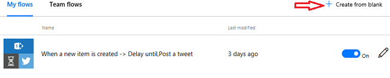
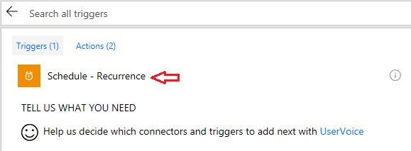
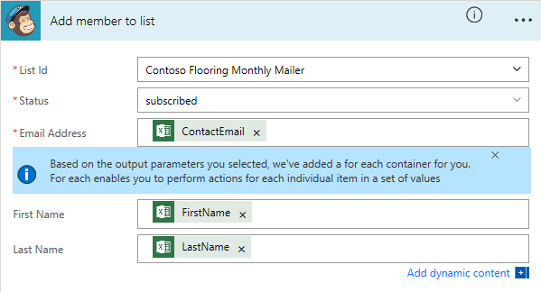
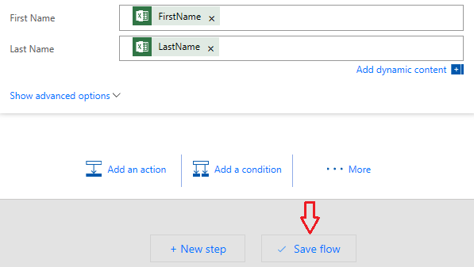

<properties
   pageTitle="Use Recurrence in Microsoft Flow| Microsoft Flow"
   description="How to use a trigger called recurrence to run flows on a particular schedule."
   services=""
   suite="flow"
   documentationCenter="na"
   authors="v-joaloh"
   manager="anneta"
   editor=""
   tags=""
   featuredVideoId="kZs7lqgp4LU"
   courseDuration="5m"/>

<tags
   ms.service="flow"
   ms.devlang="na"
   ms.topic="get-started-article"
   ms.tgt_pltfrm="na"
   ms.workload="na"
   ms.date="06/24/2017"
   ms.author="v-joaloh"/>

# Use Recurrence in Microsoft Flow 

In this lesson, you will see how to run Flows on a **Schedule** using a **trigger called Recurrence**.

## Prerequisites for this lesson ##

Before you get into the lesson, there are a couple of items that you'll need to create to build the flow: 
- An Excel workbook with customer data in a table. Include a **first name**, **last name**, and an **email address** in the file.
- Store the Excel workbook on your OneDrive for Business.

- A MailChimp account, and a **customer list in that account**. 

If you don't already have a MailChimp account, you can **sign up for an eFree trial** on their web site.

## Connect your services

As in the previous topic, if you are using a service that's new to you, then you may need to connect the new service in Microsoft Flow

Follow the instructions in the Guided Learning topic, **Create Push Notifications in Microsoft Flow**.

## Build a sample flow 

Let’s go ahead and build a flow for the Contoso marketing team. The flow **grabs customer emails from an excel table** on OneDrive for Business that the sales guy Dave uses when meeting new customers and **building quotes** for them.

The flow is built so that daily, the email addresses that were **added to the spreadsheet** are then **added to a MailChimp customer list**. That list will then **receive** Contoso Flooring **marketing emails**.

 
## Build the flow from blank

Go ahead and get into Microsoft Flow, select **My flows**, and then select **+ Create from blank**. 

To schedule a recurrence, look for the **Schedule service** in the list. If you don't see it, **enter schedule** in the search box, and it pops right up.

Select **Schedule**...

and then select **Schedule - Recurrence**.

**Set the Interval** for 1 time, and the **Frequency** for each **Day**.

Go ahead and create another step to **get the Excel rows** that Dave the sales guy is adding in daily. 

**Note:** This is the Excel file that you created in the beginning of this lesson, and placed on your OneDrive for Business.

Select **+ New step** and then **Add an action**.

 
Enter **Excel in the search bar**, and choose the service.

Notice there is an **Excel - Get row**, where if selected, you would get only one row.

Choose **Excel - Get rows**, as you want to get all of the new  rows in the file.

To show flow where your file lives,  select the folder on the **OneDrive for Business**. 

Select **Contoso-mailing-list** file from the list and select the **Table 1** name.

Now, you will decide what to do with that data in the Excel file. 

Select **+ New step** and then **Add an action**. 

Enter **chimp** in the search bar.

Add the action **MailChimp - Add member to list** by selecting **PREMIUM**.

 

Select **Contoso Flooring Monthly Mailer**.

Enter **Status** as **subscribed**.

Now, you need to tell MailChimp what information is going to be passed to it: an email address, first name, and last name.

Enter the **ContactEmail** from **dynamic content**.

When you chose the **ContactEmail field**, flow sensed that **you were going to set an action** that needed an **additional action** on top of it.  So it went ahead and added another action for you, which is, **apply to each**. Whenever it reads one of these new records, it will **create a new action** for **each new row** in the file.

Enter dynamic content for **FirstName**, and **LastName**.

To finish, select **Save flow**.

You see that your flow is updated and running.

## Next lesson

In the next lesson, you will learn how Contoso Flooring is **securing** all of their **completed customer jobs**, and then storing that information in SharePoint online for safe keeping in the cloud.