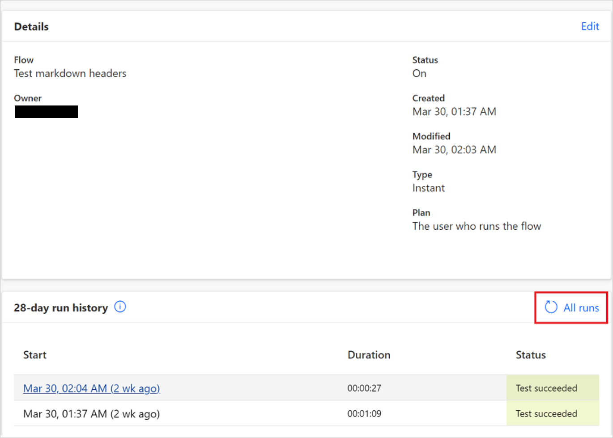

# Cancel or resubmit flow runs in bulk

You can resubmit previous runs of a flow in bulk. You can also cancel runs that are in progress.

## Resubmit flow runs

Follow these steps to resubmit flow runs in bulk:

1. Sign in to [Power Automate](https://powerautomate.com).
1. On the left panel, select **My flows**.
1. On the right panel, select the cloud flow that you would like to resubmit or cancel.
1. Select **All runs**.

    >[!div class="mx-imgBorder"]
    >

   >[!TIP]
   >The flow must have runs to cancel or resubmit the flow runs. <!--Note from Sweeny: Should this be placed in a note instead of a tip?-->

1. Select the flow runs that you would like to resubmit or cancel on the **Run history** page.

    >[!div class="mx-imgBorder"]
    >

   >[!TIP]
   >You can resubmit or cancel up to 10 flows at a time.

1. Select **Resubmit flow run(s)**.

    >[!div class="mx-imgBorder"]
     > button")

   >[!IMPORTANT]
   >The number of flows that you can resubmit is limited based on the maximum number of API calls for the connectors in the flow.

## Cancel flow runs

To cancel flow runs that are in progress, follow the steps to resubmit flow runs as outlined earlier in this article with one exception: In step 6, select **Cancel flow run(s)** as shown in the following image.

>[!div class="mx-imgBorder"]
> button")

>[!NOTE]
>The resubmit and cancel features aren't available for sovereign cloud customers.
 
[!INCLUDE[footer-include](includes/footer-banner.md)]
