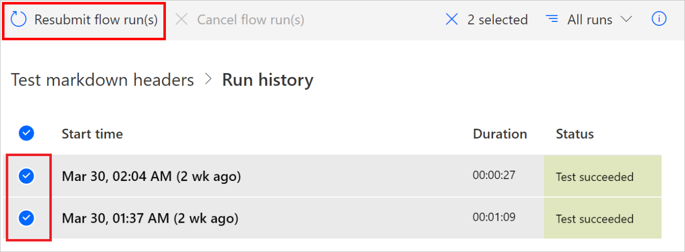

# Cancel or resubmit flow runs in bulk

You can resubmit previous runs of a flow in bulk. You can also cancel runs that are in progress.

## Resubmit flow runs

Follow these steps to bulk resubmit flow runs.

1. Sign into [Power Automate](https://powerautomate.com).
1. Select **My flows** page from the left side of the screen.
1. Select the cloud flow that you would like to resubmit or cancel.
1. Select **All runs** on the flow proprieties page.

   

   >[!TIP]
   >The flow must have runs in order to cancel or resubmit the flow runs

1. Select the flow runs that you would like to resubmit or cancel on the **Run history** page.

    

   >[!TIP]
   >You can resubmit or cancel up to 10 flows at time.

1. Select **Resubmit flow run(s)**.

    

   >[!IMPORTANT]
   >The number of flows that you can resubmit is limited based on the maximum number of API calls for the connectors in the flow.

## Cancel flow runs

To cancel flow runs that are in progress, follow the steps to resubmit flow runs as outlined earlier in this article, but select **Cancel flow run(s)** as shown in the following image.

>[!NOTE]
>The resbumit and cancel features aren't available for sovereign cloud customers.
 
[!INCLUDE[footer-include](includes/footer-banner.md)]