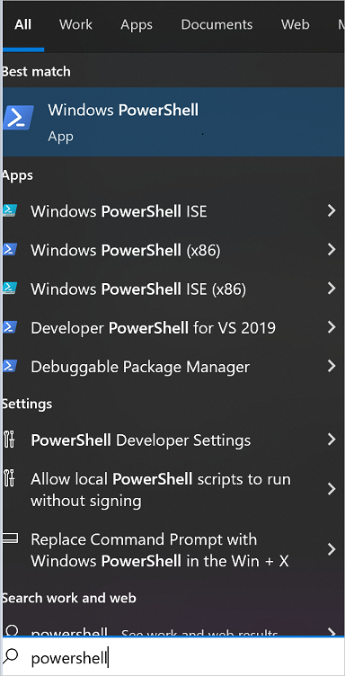
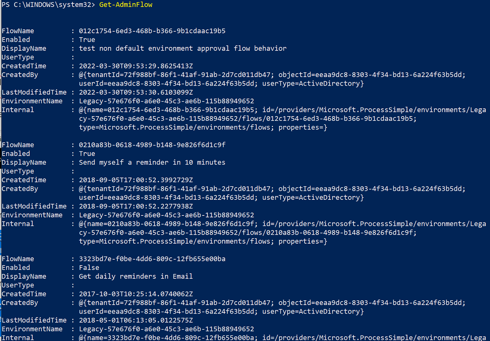

# Restore deleted flows with PowerShell

If you or someone else accidentally deletes a flow that isn't part of a solution, you can use PowerShell to restore it within 28 days of deletion.

>[!NOTE]
> - The steps in this article apply only to non-solution flows. If you deleted a flow that was part of a solution, you need to create a support ticket with Microsoft for assistance.
> - Flows that have been deleted more than 28 days ago can't be recovered, neither with PowerShell script nor Microsoft support.

## Prerequisites

- You must install the latest version of [PowerShell cmdlets for Power Apps](https://www.powershellgallery.com/packages/Microsoft.PowerApps.Administration.PowerShell/2.0.147).
- You must be an environment admin.
- There must be an [execution policy](/powershell/module/microsoft.powershell.security/set-executionpolicy) set on your device to run PowerShell scripts.

## Restore deleted flow

1. Open PowerShell with elevated privileges to begin.

    >[!div class="mx-imgBorder"]
    >

1. Install the latest version of [PowerShell cmdlets for Power Apps](https://www.powershellgallery.com/packages/Microsoft.PowerApps.Administration.PowerShell/2.0.147).

1. Sign in to your Power Apps environment.

   Use this command to authenticate to an environment. This command opens a separate window that prompts for your Azure Active Directory (AAD) authentication details.

    ``` PowerShell
    Add-PowerAppsAccount
    ```

1. Provide the credentials you want to use to connect to your environment.

1. Run the following script to get a list of flows in the environment, including flows that were soft-deleted within the past 28 days. 

    If the `IncludeDeleted` parameter isn't recognized, you might be working with an older version of the PowerShell scripts. Ensure that you're using the [latest version](https://www.powershellgallery.com/packages/Microsoft.PowerApps.Administration.PowerShell/2.0.147) of the script modules and retry the steps.

   ``` PowerShell
   Get-AdminFlow -EnvironmentName 41a90621-d489-4c6f-9172-81183bd7db6c -IncludeDeleted $true
   //To view examples: Get-Help Get-AdminFlow -Examples
   ```

   >[!TIP]
   >Navigate to the URL of any of the flows in your environment to get your environment name (flow.microsoft.com/Environments/<**EnvironmentName**>/Flows) which is required for subsequent steps. Don't omit the prefixed words in the URL if your environment name contains it, for example, Default-8ae09283902-.... 

    >[!div class="mx-imgBorder"]
    >

1. Optionally, you can filter the list of flows if you know part of the name of the deleted flow whose flowID you want to find. To do this, use a script similar to this one that finds all flows (including flows that were soft-deleted) in environment 3c2f7648-ad60-4871-91cb-b77d7ef3c239 that contain the string "Testing" in their display name.
256fe2cd306052f68b89f96bc6be643

   ``` PowerShell
   Get-AdminFlow Testing -EnvironmentName 3c2f7648-ad60-4871-91cb-b77d7ef3c239 -IncludeDeleted $true
   ```

1. Make a note of the `FlowName` value of the flow you want to restore from the previous step.

1. Run the following script to restore the soft-deleted flow with `FlowName` value as 4d1f7648-ad60-4871-91cb-b77d7ef3c239 in an environment named Default-55abc7e5-2812-4d73-9d2f-8d9017f8c877.

   ``` PowerShell
   Restore-AdminFlow -EnvironmentName Default-55abc7e5-2812-4d73-9d2f-8d9017f8c877 -FlowName 4d1f7648-ad60-4871-91cb-b77d7ef3c239
    //To view examples: Get-Help Restore-AdminFlow -Examples
   ```

1. Optionally, you can run the ```Restore-AdminFlow``` script with the following arguments to restore multiple deleted flows.

   ``` PowerShell
   foreach ($id in @( "4d1f7648-ad60-4871-91cb-b77d7ef3c239", "eb2266a8-67b6-4919-8afd-f59c3c0e4131" )) { Restore-AdminFlow -EnvironmentName Default-55abc7e5-2812-4d73-9d2f-8d9017f8c877 -FlowName $id; Start-Sleep -Seconds 1 }
   ```
