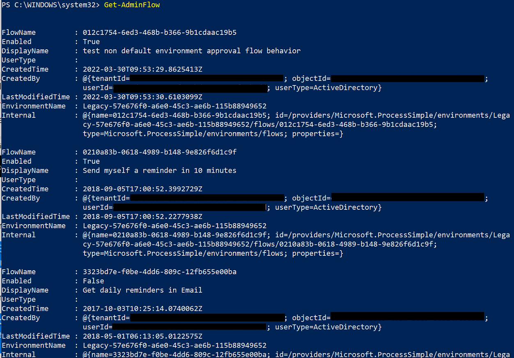

# Restore deleted flows

If you or someone else accidentally deletes a flow that isn't part of a solution, you can restore it within 28 days of deletion.

There are the two ways you can restore deleted flows.

- Use the [Power Automate Management connector](#restore-deleted-flows-with-the-management-connector) to restore deleted flows.
- Use [PowerShell](#restore-deleted-flows-with-powershell).

>[!NOTE]
> - The steps in this article apply only to non-solution flows. If you deleted a flow that was part of a solution, you need to create a support ticket with Microsoft for assistance.
> - Flows that were deleted more than 28 days ago can't be recovered, neither with PowerShell script, the Power Automate Management connector, nor Microsoft support.
> - After you restore a flow, it defaults to the disabled state. You must manually enable the flow, per your requirements.

## Restore deleted flows with the management connector

You can also restore a deleted non-solution-aware flow within 28 days of deletion using Power Automate. As an admin, all you need is an instant flow with the Power Automate management connector actions, **Restore Deleted Flow as Admin**.  

Follow these steps to use the **Power Automate Management** connector to restore a deleted flow.

1. Sign in to [Power Automate](https://powerautomate.com).

1. Create an **Instant cloud flow**.

    :::image type="content" source="media/restore-deleted-flow/create-instant-flow.png" alt-text="An image that displays a flow with the trigger to manually start it.":::

1. Add the **Manually trigger a flow** trigger.

    :::image type="content" source="media/restore-deleted-flow//select-manual-trigger.png" alt-text="An image of the manual trigger.":::

1. Add a **New step**, and then search for and select the **Power Automate Management** connector.

    :::image type="content" source="media/restore-deleted-flow/select-management-connector.png" alt-text="An image that displays the management connector.":::

    <!--- 
    1. Select the **List flows as an admin** action.
    
        
    --->

1. Optionally, you can need to sign in to the **Power Automate management** action.

    :::image type="content" source="media/restore-deleted-flow/sign-in-to-management-connector.png" alt-text="An image that shows how to sign in to the management connector.":::

    <!---
    1. Select the environment that contains the flow you want to restore.
    
       
    
    1. Perform a test run the flow to note the **name** of the flow that you want to restore.
    
       
    
    ### Restore the deleted flow
    
    Now that you have the name of the flow, it's time to edit the flow to restore it. 
    
    --->

1. Add the **Restore Deleted Flow as Admin** action as a new step in the flow.

    :::image type="content" source="media/restore-deleted-flow/select-restore-deleted-flows-admin-2.png" alt-text="An image that displays the restore deleted flow as admin action.":::

1. Select the **Environment** that contains the flow that you want to restore, and then select the **Flow** that you want to restore.

    :::image type="content" source="media/restore-deleted-flow/restore-deleted-flows-card.png" alt-text="An image that displays the Restore deleted flows as admin action card.":::

1. Run the flow to restore the deleted flow. After a successful run, you'll get output that confirms that flow was restored.

    :::image type="content" source="media/restore-deleted-flow/restored-flow.png" alt-text="An image that displays the results of a successful restore operation on a deleted flow.":::

## Restore deleted flows with PowerShell

In this section, you'll learn about how to restore deleted flows using PowerShell.

### Prerequisites for PowerShell

- You must install the latest version of [PowerShell cmdlets for Power Apps](https://www.powershellgallery.com/packages/Microsoft.PowerApps.Administration.PowerShell/2.0.147).
- You must be an environment admin.
- There must be an [execution policy](/powershell/module/microsoft.powershell.security/set-executionpolicy) set on your device to run PowerShell scripts.

1. Open PowerShell with elevated privileges to begin.

    >[!div class="mx-imgBorder"]
    >

1. Install the latest version of [PowerShell cmdlets for Power Apps](https://www.powershellgallery.com/packages/Microsoft.PowerApps.Administration.PowerShell/2.0.147).

1. Sign in to your Power Apps environment.

   Use this command to authenticate to an environment. This command opens a separate window that prompts for your Azure Active Directory (Azure AD) authentication details.

    ``` PowerShell
    Add-PowerAppsAccount
    ```

1. Provide the credentials you want to use to connect to your environment.

1. Run the following script to get a list of flows in the environment, including flows that were soft-deleted within the past 28 days. 

    If the `IncludeDeleted` parameter isn't recognized, you might be working with an older version of the PowerShell scripts. Ensure that you're using the [latest version](https://www.powershellgallery.com/packages/Microsoft.PowerApps.Administration.PowerShell/2.0.147) of the script modules and retry the steps.

   ``` PowerShell
   Get-AdminFlow -EnvironmentName 41a90621-d489-4c6f-9172-81183bd7db6c -IncludeDeleted $true
   //To view examples: Get-Help Get-AdminFlow -Examples
   ```

   >[!TIP]
   >Navigate to the URL of any of the flows in your environment to get your environment name (flow.microsoft.com/Environments/<**EnvironmentName**>/Flows) which is required for subsequent steps. Don't omit the prefixed words in the URL if your environment name contains it, for example, Default-8ae09283902-.... 

    >[!div class="mx-imgBorder"]
    >

1. Optionally, you can filter the list of flows if you know part of the name of the deleted flow whose flowID you want to find. To do this, use a script similar to this one that finds all flows (including flows that were soft-deleted) in environment 3c2f7648-ad60-4871-91cb-b77d7ef3c239 that contain the string "Testing" in their display name.
256fe2cd306052f68b89f96bc6be643

   ``` PowerShell
   Get-AdminFlow Testing -EnvironmentName 3c2f7648-ad60-4871-91cb-b77d7ef3c239 -IncludeDeleted $true
   ```

1. Make a note of the `FlowName` value of the flow you want to restore from the previous step.

1. Run the following script to restore the soft-deleted flow with `FlowName` value as 4d1f7648-ad60-4871-91cb-b77d7ef3c239 in an environment named Default-55abc7e5-2812-4d73-9d2f-8d9017f8c877.

   ``` PowerShell
   Restore-AdminFlow -EnvironmentName Default-55abc7e5-2812-4d73-9d2f-8d9017f8c877 -FlowName 4d1f7648-ad60-4871-91cb-b77d7ef3c239
    //To view examples: Get-Help Restore-AdminFlow -Examples
   ```

1. Optionally, you can run the ```Restore-AdminFlow``` script with the following arguments to restore multiple deleted flows.

   ``` PowerShell
   foreach ($id in @( "4d1f7648-ad60-4871-91cb-b77d7ef3c239", "eb2266a8-67b6-4919-8afd-f59c3c0e4131" )) { Restore-AdminFlow -EnvironmentName Default-55abc7e5-2812-4d73-9d2f-8d9017f8c877 -FlowName $id; Start-Sleep -Seconds 1 }
   ```
