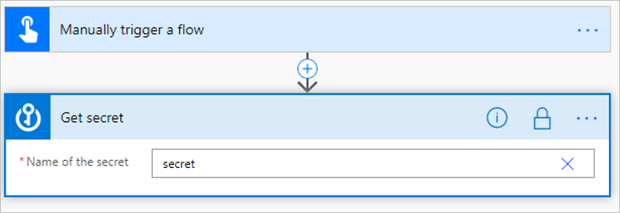
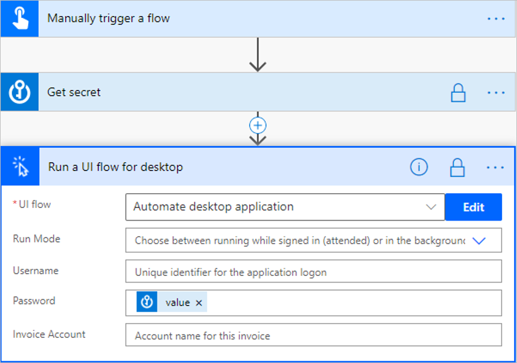

# Manage sensitive input like passwords

Some inputs like passwords need to be omitted from the logs. Power Automate uses **Sensitive text inputs** to store these "confidential" values.

Follow these steps to turn on **Secure Inputs** and **Secure Outputs** to work with sensitive content from connectors.

1. On the top right corner of an action, select (**…**).

1. Select **Settings**.

    >[!div class="mx-imgBorder"]
    >

1. Turn on the **Secure Inputs** and **Secure Outputs** properties to prevent these values from being shown in the logs.

    >[!div class="mx-imgBorder"]
    >

1. Select **Done**.

  You'll notice that the action now has a lock icon on the top right, indicating special handling for input and output values.

  

  >[!TIP]
  >Follow the same steps to configure inputs as given earlier in this article to pass the output from this connector to a desktop flow, and then turn on **Secure Text** in the **Settings**.

  

[!INCLUDE[footer-include](includes/footer-banner.md)]
