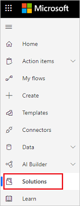
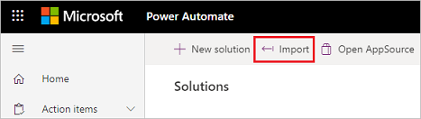
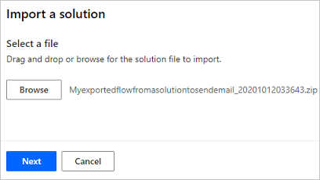

# Import a solution

> [!TIP]
> If you want to have your flows start automatically after you import a solution, use the Microsoft Dataverse connector in your flow when you create it.

After you've exported your solution, you can import it into any environment that meets the prerequisites. Follow these steps to import a solution.

1. Sign into [Power Automate](https://powerautomate.com), and then select **Solutions** from the navigation bar on the left side of the screen.

   

1. Select **Import**.

   

1. Select **Browse** from the **Import a solution** page that opens.
1. Find, and then select the solution that you want to import.
1. Select **Open**.

   You should now see the **Import a Solution** page similar to the following image.

   

1. Select **Next**.

   If there are no errors, the importation completes within a few moments.

> [!NOTE]
> You cannot import a solution into an environment in which the solution already exists.

## Learn more

- [Create a solution](./overview-solution-flows.md)
- [Create a cloud flow in a solution](./create-flow-solution.md)
- [Export a solution](./export-flow-solution.md)
- [Edit a solution-aware flow](./edit-solution-aware-flow.md)
- [Remove a solution-aware flow](.//remove-solution-aware-flow.md)

[!INCLUDE[footer-include](includes/footer-banner.md)]