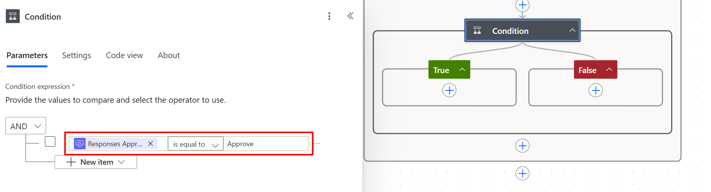
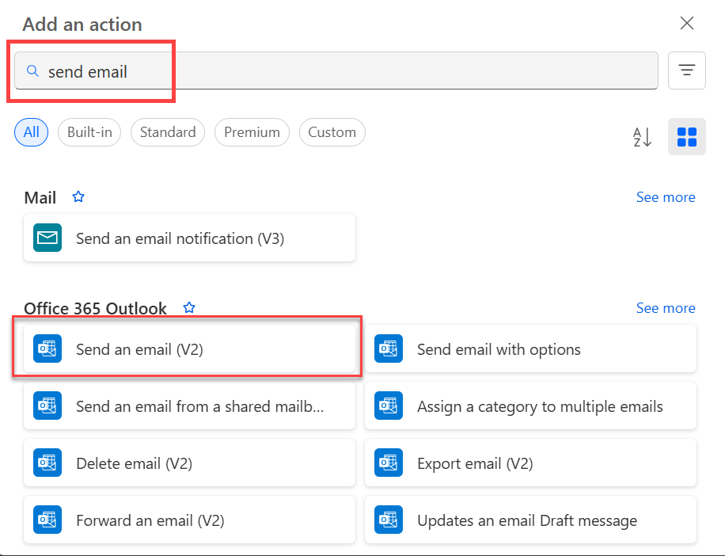

1. Select **Add an action** on the **If yes** branch of the condition.

    
1. Enter **send email** into the search box on the **Choose an action** card.
1. Select the **Send an email (V2)** action.

    
1. Configure the email card to suit your needs.

     >[!NOTE]
     > **To**, **Subject**, and **Body** are required.

     This card is a template for the email that is sent when the status of the vacation request changes.

     In the **Body** box on the **Send an email (V2)** card, use the **Comments** token from the **Approvals - Start an approval** action.
