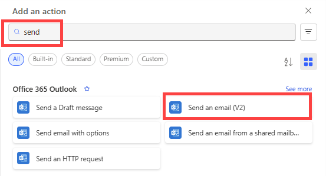

1. Select **Add an action** on the **If no** branch.
2. Enter **Send** into the search box of the **Choose an action** card, select **Office 365 Outlook** to filter the actions, and then select the **Send an email (V2) - Office 365 Outlook** action.

    
3. Configure the email card to suit your needs.

     This card represents the template for the email that's sent when the status of a vacation request changes.
