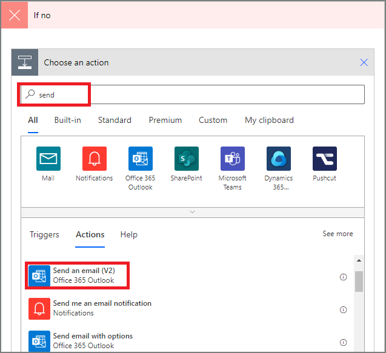

1. Select **+Add an action** on the **If no** branch.
2. Type **Send** into the search box of the **Choose an action** card, and then select the **Send an email - Office 365 Outlook** action.

    
4. Configure the email card to suit your needs.

     This card represents the template for the email that's sent when the status of vacation requests change.
