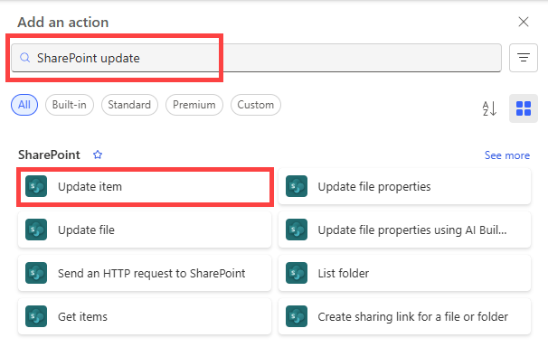

1. Select **Add an action** in the **If yes** branch.
1. Enter **SharePoint** in the search box on the **Choose an action** card, select the **SharePoint** filter, and then select the **Update item** action.

    
1. Configure the **Update item** card to suit your needs.
