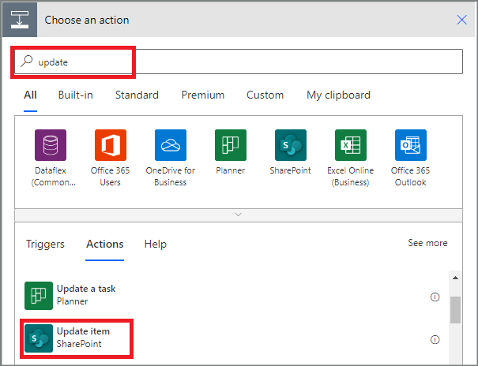

1. Select **Add an action** in the **IF YES** branch.
1. Type **update** in the search box on the **Choose an action** card, and then select the **Update item - SharePoint** action.

    
1. Configure the **Update item** card to suit your needs.
