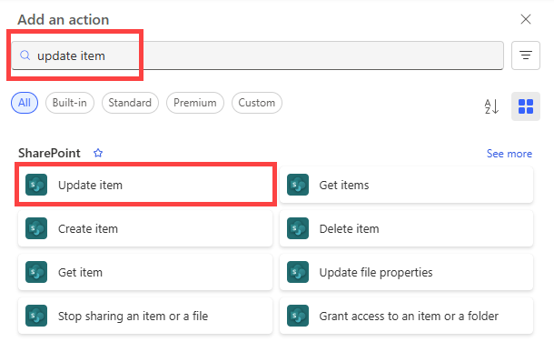

1. Select **Add an action**.
2. Enter **update** into the search box on the **Choose an action** card, and then select the **Update item - SharePoint** action.
   
    
4. Configure the card to suit your needs.
