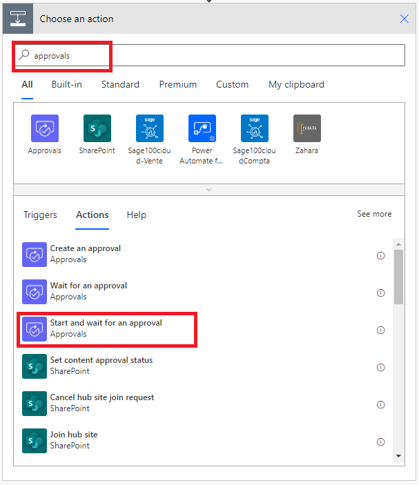
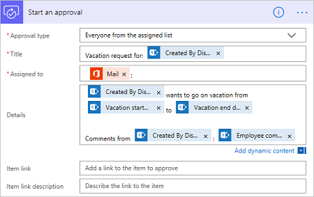

1. Select **New step**
1. Type **approval** into the **Choose an action** search box.
1. Select the **Start and wait for an approval** action.

    

1. Configure the **Start and wait for an approval** card to suit your needs.

     >[!NOTE] 
     > The **Approval type**,  **Title** and **Assigned To** fields are required.
     > You can use [Markdown](https://aka.ms/approvaldetails) to format the **Details** field.
     > 
     >

    

