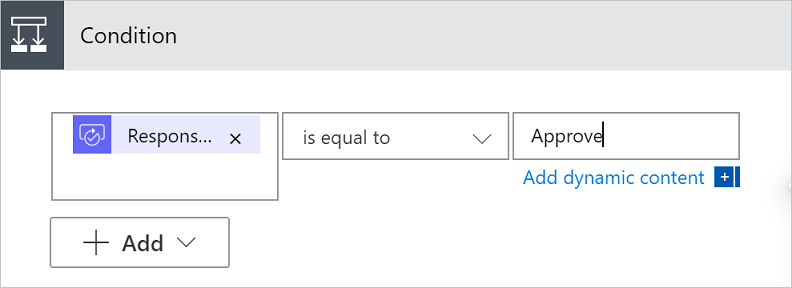

1. Select **New step**, and then select **Condition** in the list of actions.
1. On the **Condition** card, select **Choose a value** on the left.

   A list of dynamic values display.
   
1. Select **Responses Approver response** from the list of dynamic values.
  
    
1. Select the **Choose a value** box on the right, and then enter **Approve** into the box.

   > [!NOTE]
   > The valid responses to the **Approvals - Start an approval** action are "Approve" and "Reject". These responses are case-sensitive.

1. Your **Condition** card should now show:

    
