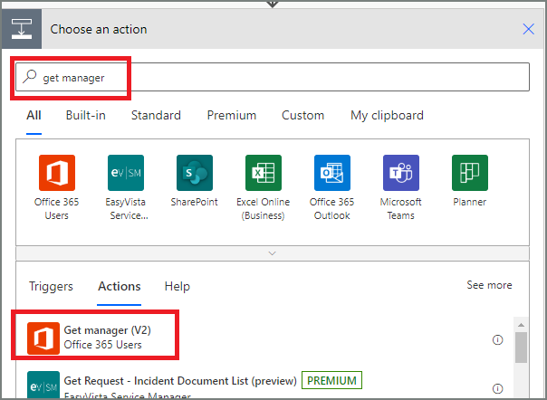
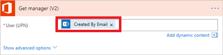

1. Select **+New step**, and then type **get manager** into the **Choose an action** search box.
1. Find, and then select the **Get manager (V2) - Office 365 Users** action.

    
1. Insert the **Created By Email** token into the **User (UPN)** box on the **Get manager** card.

    This action gets the manager for the person who created the vacation request in SharePoint.

    

