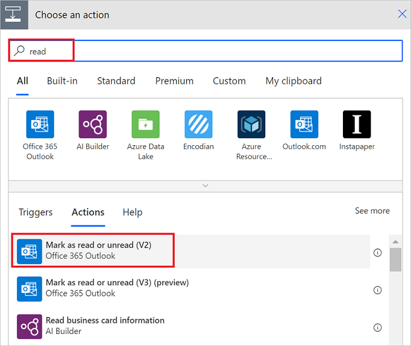
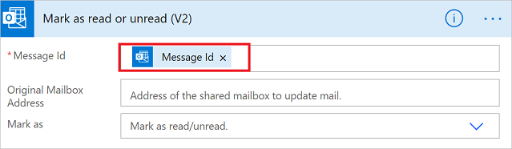

1. Select **New step**.
2. Search for "read", and then select **Mark as read or unread (V2)** from the list of actions.
   
    
3. In the **Mark as read** card, add the **MessageId** token in the **Message Id** box.
   
     If the **Message Id** token isn't visible, search for it by entering **Message Id** in the search box.
   
    

