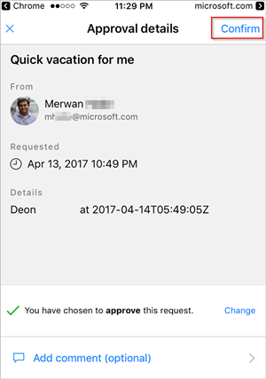

If you're an approver in an approval flow, you receive an email whenever someone creates a request. The approval request is also sent to the approvals center. You can then approve or reject requests from the email, the approvals center, or the Power Automate app.

To approve a request:

### From email
1. Select **Approve** from the email you receive when an item is added to the SharePoint Online list.
   
     Note: If you're using a mobile device with the Power Automate app installed, the Power Automate app launches, otherwise, the approvals center opens in your browser.

1. Enter a comment, and then select the **Confirm** button.

### From the approvals center

1. Sign in to [Power Automate](https://flow.microsoft.com).
1. Select the **Action items**>**Approvals** in the left-side navigation pane.
1. Select **Approve** on the request you want to approve.
1. Add any comments, and then select **Confirm** at the bottom of the screen.

### From the Power Automate app

1. On your mobile phone with the Power Automate app installed, select **Approve** from the request approval email.
1. Select **Confirm** in the upper right corner of the screen.

    
1. The success page shows, indicating that your approval has been recorded.

>[!Note]
>The screens on Android, iOS and Windows Phone may differ slightly, however, the functionality is the same on all devices.
