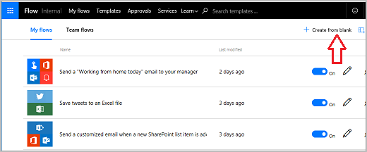
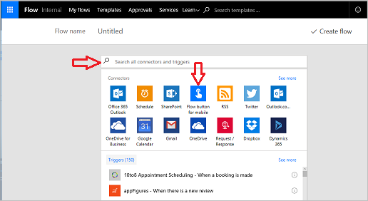
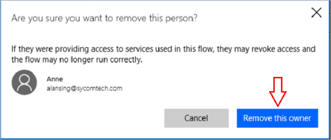

In this topic, you will learn how to **build a button flow** for the Contoso Flooring Company. 

Button flows can be used to **send email** to a team and **alert them of tasks** to perform. **Ownership** of the flows **can be assigned to one** worker or **shared by multiple** members on a team.  

1. First, go to the [Power Automate website](https://ms.flow.microsoft.com) and sign in.
2. Once you are done signing in, select **My Flows**, and then **Create from blank**.
   
    
   
    The first thing you'll need is a trigger. The button flow is a convenient one to use. 
3. If it's not there in your list, select **Search hundreds of connectors and triggers** at the bottom of the page, enter **button**, and it will pop up for you. 
4. Select **Flow button for mobile**.
   
     
5. Select **Flow button for mobile - Manually trigger a flow**.
   
    
6. On the input screen, select **Add input text**,
   
    
7. Enter **Contoso Flooring** in the first text box, and **Warehouse delivery email** in the second text box.
   
    
8. Select **New step**. 
   
    
9. Select **Add an action**. 
   
    
10. Select the **Office 365 Outlook** connector. If it isn't there, search for **outlook**.
    
     
11. Select **Office 365 Outlook - Send an email**.
    
     
    
     When the button is pressed, an email is sent to the whole Contoso Warehouse team, no matter where they are in the building, letting them know that the delivery has arrived.
12. Expand the fields and customize the email to work for Contoso Flooring.
    
    1. In the **To** field, enter an email address that is valid in your organization.
    2. In the **Subject** field, enter **Delivery Arrived**. 
    3. To the right, notice a **Dynamic content** box popped up. To show, in the subject line, the exact date and time the button was pressed, select **Date** and **Timestamp**. 
       
        
13. Now, enter a simple **Body** for the email saying something like, **Warehouse Team, please come to the unload bay as todays delivery has arrived**.
14. Select **Create flow** to save the flow.
    
     

## Create a team flow
You can use this button flow as an example of how to create a team flow. What if the creator of this flow is out sick? What if that person leaves the company? You want to make sure that this flow keeps running. To do that,  add co-owners.

1. Select the **team icon** on your flow to add a co-owner.
   
     
2. Enter names, email addresses, or user groups to add co-owners.
   
    
3. To remove co-owners, select the trash can to the right of their name.
   
    
4. Select **Remove this owner** to finish the removal.
   
    

## Summary
In this lesson, you've seen how to **create a button flow**. 

In minutes, the flow gave a warehouse worker the ability to **alert the team** to a **delivery arrival**, so that the team didn’t have to stand around and wait, wasting valuable time they could spend on other tasks. 

The worker then shared that button out to the team, so others could trigger the same flow if that person wasn’t around.

## Next lesson
Check out the next lesson to see how to create a cloud flow that uses **push notifications**.

