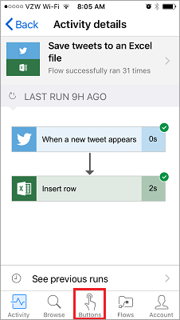
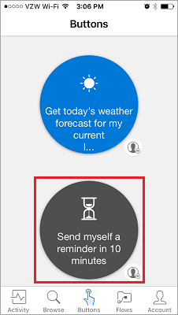
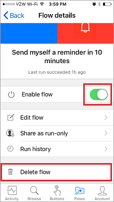

In this lesson, we'll be covering the Power Automate mobile app and its capabilities. From the mobile app, you can access these features: **Activity Feed**, **Browsing**, **Buttons**, and **Managing Flows**.

First, you’ll need to **download** and **install** the Power Automate app from your app store.

Once it's installed, **open it** and **sign in**. When you open the app, you land on the **Activity Feed**.

The Activity Feed is the spot to see what’s happening with your flows, **while you are on the go** and may not have **access to your computer** for a full experience.

For instance, if you select any of these flows, you can **get a closer look** at that flow's **last activity**, whether it succeeded or failed to run, and if it failed, which step it failed on.

As you can see, this flow succeeded in both steps. From here, go ahead and select the **Buttons** icon.

## How flows are started
   Buttons are flows that are started with a manual action. For example, you could create a button like **Send a "Working from home today" email to your manager**.
   You could use this one if you live far away and on days when the traffic is a mess!

Use the **Browse** button to check out templates for **more button flows** to add to your collection.

To see how that works, we'll use the **Send myself a reminder in 10 minutes** button flow.

1. Select **Buttons**, then **Browse templates**.
2. Select the reminder button flow.
3. Tap **Use this template**.
   
    
4. Tap **Create**.
   
    
   
    The flow is **saved**.
   
    
5. Tap **Buttons** to see the new flow. 
   
    
6. Go ahead and tap it, and in 10 minutes, you'll **get a reminder**.
   
    

It's simple to add additional buttons to your collection.

## Modify or delete a cloud flow
If you decide that you want to modify or delete one of your flows, it's easy.

1. Tap the **Flows** button, which is essentially the mobile management area for your flows.
   
    
2. Now, tap one of your flows.
   
    
   
    You can see that there are a few options:
   
   * To enable or disable the flow, tap the **Enable flow** toggle switch.
   * You can always edit the flow, in case you want to make it useful to yourself again. 
   * And you can see the run history of the flow, to get an idea of its successful and unsuccessful runs.
   * You can also delete the flow by tapping the **Delete flow** button.
     
     
     
     Here, you see the **flow has been deleted**.
     
     

## Next Lesson
The next lesson covers **how to create a button flow** for a team. 

