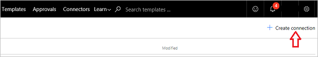
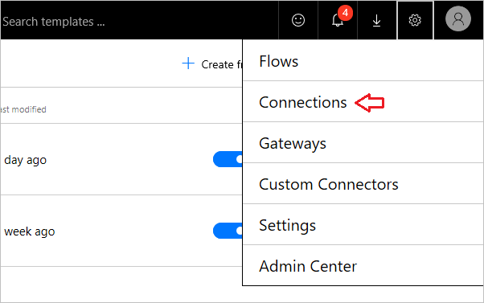

For this flow, you'll build a **SharePoint** list where the Marketing team for **Contoso Flooring** stores their **Twitter posts** and posting dates. From there, you will build a cloud flow that will auto-Tweet the content for them. 

## Connect Power Automate Services
In this topic, you'll be using the **SharePoint** and **Twitter** services. If you are using a service that's new to you, then you'll first need to connect to the new service. 

1. In Power Automate, select the **gear icon**, then **Connections**,
   
     
2. Select **+ Create connection**.
   
     
3. Scroll down the list, find Twitter, and select **+**.
   
    
4. To authorize a Twitter account, enter your username or email, and your password, and then select **Authorize app**.
   
    
5. To check your connections,  select the **gear icon** and **Connections**.
   
    
   
    You should see your new Twitter connection and any other connections you have created. 
   
    

## Build a SharePoint List
The first thing you need to do is create a new SharePoint Online list for Contoso Flooring. 

1. In SharePoint Online, select **New**, and then **List**.
   
    
2. Name the list **Contoso Tweets**. 
3. Clear the **Show in site navigation** check box, and select **Create**.
   
    
   
    When you select **Create**, SharePoint takes you to your new list.
4. By default, the list has a single column - **Title**. Add another column and name it **Tweet Contents**. The things that you’ll say in your tweets will go here. 
   
   1. Select the plus sign, then select **More...**
      
       
   2. Select **Multiple lines of text**, then select **OK**.
      
       
5. Add a column for the tweet date and time, and name it **Tweet Date**.
   
   1. As with **Tweet Contents** above, select the plus sign, then select **More...**
      
       
   2. Scroll down to **Date and Time Format**. Select **Date & Time**, so that both are included.
      
       
   3. Select **OK**. You see the **Contoso Tweets** list in your SharePoint site, and you can add new items to the list.

## Build the flow
Your list is built, so now you can build the flow.

### Choose a trigger
1. In Power Automate, go to **My Flows**, then select **Create from blank**.
   
    
2. Select **When an item is created**.
   
    
   
    We want our trigger to fire when a new row is added with tweet content.
3. Select your SharePoint site, then select the list that you set up earlier, **Contoso Tweets**.
   
    

Okay, that’s it for the trigger.

### Add an action to delay posting
1. Select **+ New step**, then select **Add an action**. 
   
    
2. Under the **Schedule** service, select **Delay until**. 
   
      
3. Set the delay value.
   
   1. Click or tap in the **Timestamp** field. 
   2. When the dynamic content box opens, scroll down to the bottom, and you see the three columns from the SharePoint list: **Title**,  **Tweet Date**, and **Tweet Content**.
   3. Select **Tweet Date**. 
      
       
      
       Now, when someone adds something to your SharePoint list, it will delay any action until the date and time you set in the **Tweet Date** column.
      
       

### Add an action to post a Tweet
Now you'll add another action for the flow to take at the date and time specified in the **Tweet Date** column.

1. Select **+ New step**, **Add an action**, then search for **Twitter**.
   
     
2. Choose the action, **Twitter - Post a tweet**.
   
     
3. Click or tap in the **Tweet text** field, and in the dynamic content box, select **Tweet Contents**. Here's the sequence you have created. 
   
    
4. Select **Create flow...**
   
     
5. Select **Done**.
   
    
   
    Now the flow is complete.
   
    
   
    When a new item is created in your SharePoint list, the flow will delay posting until the pre-set date. When that date is met, the flow will post to Twitter with the text from the **Tweet Content** column in your list.

## Next lesson
In the next lesson, you'll learn how to **run flows on a schedule** using a trigger called **Recurrence**.

