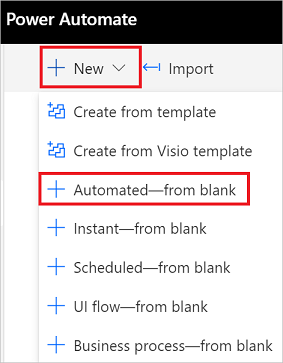
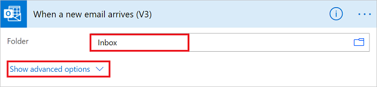

1. Sign in to [Power Automate](https://flow.microsoft.com), and then select the **My flows** tab from left side.
1. Select **New flow** and click on the **Automated cloud flow**.
   
    
1. Give your flow a name and Search for "new email" in the **"Choose your flow's trigger"** field. Select **When a new email arrives (V3)** from the list of triggers. This trigger runs each time an email arrives. Click on the **Create** button.
   
    
1. Select the folder that you'd like the flow to monitor for incoming emails, and then select **Show advanced options**.

    
   
     >[!NOTE]
     > To display all your email folders, select the **Show Picker** icon, which is located on the right side of the **Folder** box on the **When a new email arrives (V3)** card.
   

