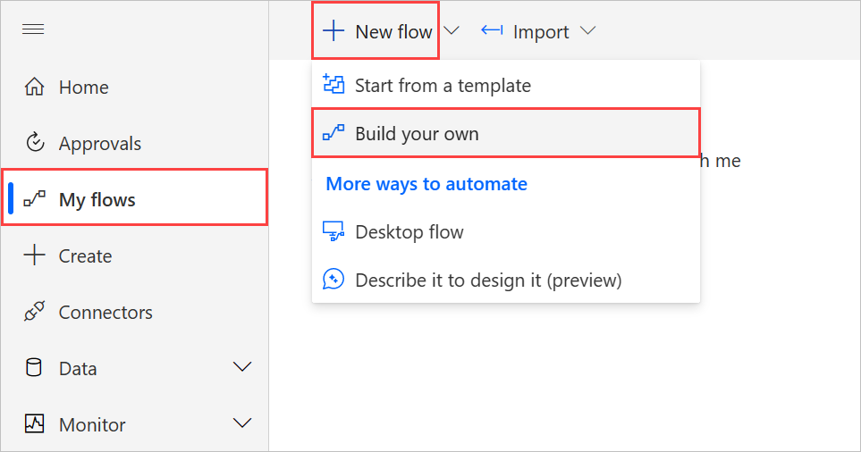
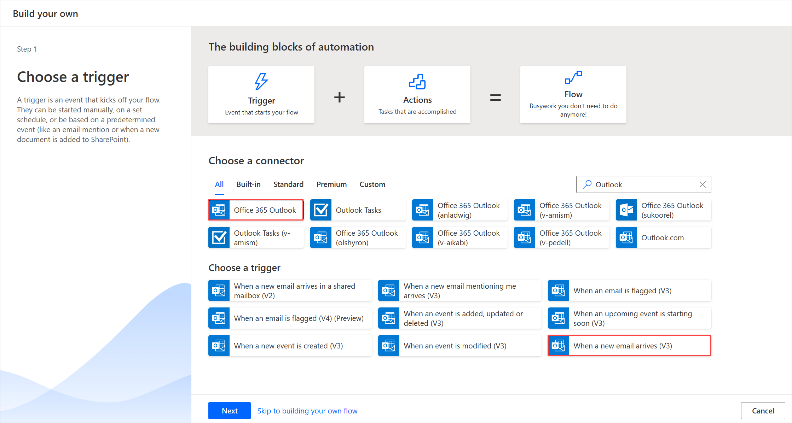

1. Sign in to [Power Automate](https://flow.microsoft.com).

1. On the left pane, select **My flows**.

1. Select **New flow** > **Automated cloud flow**.

    > [!div class="mx-imgBorder"]
    > 

1. Search for **email**, and then select **Office 365 Outlook - When a new email arrives (V3)** from the list of triggers. This trigger runs each time an email arrives.
   
    

