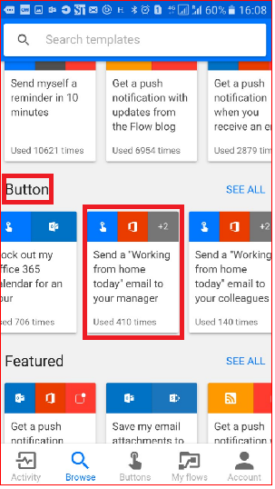
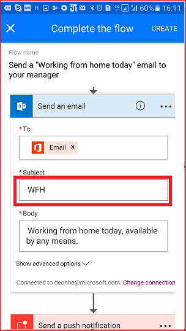

<properties
    pageTitle="Implicit parameters for Microsoft button flows | Microsoft Flow"
    description="Introduction to to implicit parameters for Microsoft button flows."
    services=""
    suite="flow"
    documentationCenter="na"
    authors="msftman"
    manager="anneta"
    editor=""
    tags=""/>

<tags
   ms.service="flow"
   ms.devlang="na"
   ms.topic="article"
   ms.tgt_pltfrm="na"
   ms.workload="na"
   ms.date="12/07/2016"
   ms.author="deonhe"/>

# Get started with implicit parameters

## What are implicit parameters?
Implicit parameters are data points that are known and available to the device on which a button flow is running. 

For example, if you are running a button flow on a smart phone, it is likely that the **phone implicitly knows the time** at your current location as well as the date and your current address. In this context, the time, date and address where the phone is located are all *implicit* parameters. They automatically available for use in any button flows that are executed on the device. You can use these implicit parameters to build useful apps that will minimize repetitive tasks such as providing your location to someone or tracking how much time you spent on a particular job/service call.

### List of implicit parameters
Here's the list of implicit parameters that are available for you to use when creating your button flows.

Parameter| Description
---------|------------
City| The city in which the device that's running the flow is located.
Country/Region|The country/region in which the device that's running the flow is located.
Full address|The full address where the device that's running the flow is located.
Latitude|The latitude in which the device that's running the flow is located.
Longitude|The longitude in which the device that's running the flow is located.
PostalCode|The postal code in which the device that's running the flow is located.
State|The state in which the device that's running the flow is located.
Street|The street on which the device that's running the flow is located.
Timestamp|The time in the area where the device that's running the flow is located.
Date|The date in the area where the device that's running the flow is located.
User name|The user name of the person signed into the device that's running the flow.
User email|The email address of the person signed into the device that's running the flow.

## Create a button flow that uses implicit parameters
When you create a [button](./introduction-to-button-flows.md), you can use implicit parameters to add rich functionality to your button. 

In this walk-through, we will create a button flow on an Android device. The button flow will use implicit parameters to send the date and your full address in a "Working from home" email to your boss.  

Here you will see screen-shots from an Android device, however, the experience is similar on iOS devices as well.

### Prerequistes 

- A work or school account with access to Microsoft Flow  
- An Android or iOS device with the Microsoft Flow app installed

1. Launch Flow and select **Browse**   
  
1. Select the **Send a 'Working from home today' email to your manager** service under the **Button** section   
  
1. Select **USE THIS TEMPLATE**  
  
4. Select **Edit** on the **Send an email** card  
  
5. Tap the **Subject** text box and enter: " **today -** " into the text box after the "WFH" text. Notice that when you tapped on the text box, a list of parameters/tokens also opened up. We'll use one of these tokens in the next step to add the date to the subject of the email.  
  
6. With the cursor still in the subject text box, scroll to the **manual** list of parameters and tap **Date**. Notice the date parameter is now in the **Subject** text box:  
  
7. Scroll to the **Body** text box and tap after the default message so that additional tokens can be included there.
  
8. Tap the **Full address** parameter, then tap **Create**  
  
1. Tap **Done**. Your button flow is now created.  
  

## Run the button flow

**NOTE**: This button flow will send your current location via email.  

1. Tap the **Buttons** category at the bottom of the screen. You will see a list of the buttons that you have permissions to use. Tap the button that represents the button flow you just created:  
  
1. Tap **ALLOW** to indicate that it's OK for the button flow to access your device's location information:  
  
1. Within a few moments, notice that the email was sent to your boss:  
  

Congratulations, you've just created a button flow that uses both the date and full address implicit parameters. 

## Next steps

- [Learn about button flows](./introduction-to-button-flows.md)  
- [Learn about flows](./guided-learning/learning-introducing-flow.md)
