# Introducing instant flows

There are many repetitive tasks that we all wish we could run with just a tap of a button. For example, you may need to quickly email your team to remind them to join the daily team sync, or you may want to start a new Visual Studio Codespaces build of your code base after you've been notified that there are no more checkins planned for the day. Instant flows allow you to accomplish these and many other tasks simply by tapping a button on your mobile device.

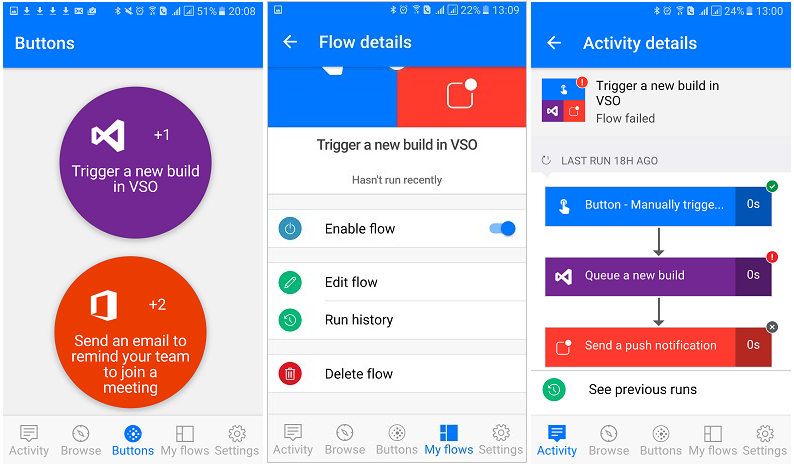 

> [!NOTE]
> You can create instant flows either from your mobile device or from Power Automate.

## Why create buttons?
Create buttons so that you can easily run repetitive tasks from any place, at anytime via your mobile device. Running buttons saves you time and, since the tasks they perform are automated, there will be less errors than if you manually did them.  

## Create a button
### Prerequisites
* Access to [Power Automate](https://flow.microsoft.com).
* An account with permissions to use the connectors to create your button. For example, you will need a Dropbox account in order to create a button that accesses Dropbox.

### From the portal
In this walk-through, let's create a button that starts a Visual Studio Codespaces build and sends notifications to let you know when the build starts:

1. Sign in to [Power Automate](https://flow.microsoft.com).
1. Select **Create** from the left side of the screen.
1. Select **Instant flow**.
1. Give your flow a name in the **Flow name** > **Manually trigger a flow** > **Create**. 
 
2. Select the **Trigger a new build in VSO** template from the list of templates.  
   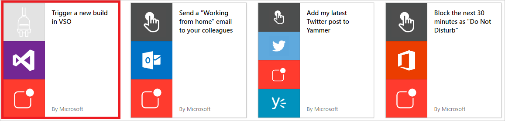  
3. Select the **Use this template** button on the **Trigger a new build in VSO** page.   
   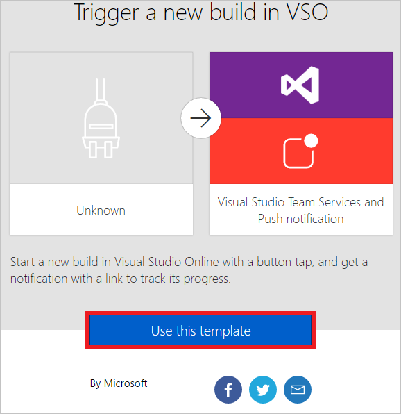  
4. If you aren't signed in, you'll be prompted to do so at this point:  
   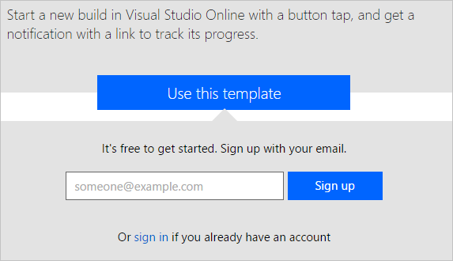  
5. After you've signed into Flow, you'll be prompted to sign into the connectors used in the template you've selected. In this example, in step 2 above we selected the **Trigger a new build in VSO** template, so we have to sign into VSO (and any other connectors you are working with), if you're not already signed in:  
   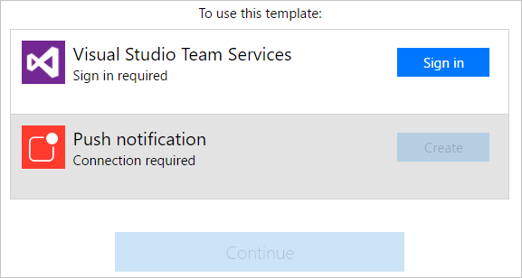    
6. Select the  **Accept** button if you agree to authorize Power Automate to access your VSO account.  
      
   **Note** You'll need to authorize each connector similarly. The designer should appear like this when you are ready to move on to the next step. Select the **Continue** button to move on:  
   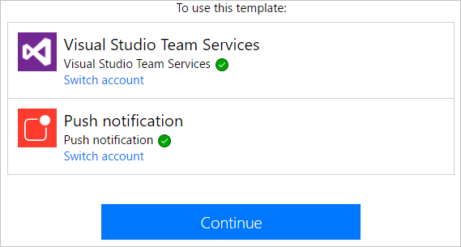   
7. You are now ready to configure the properties for the build you wish to start:    
   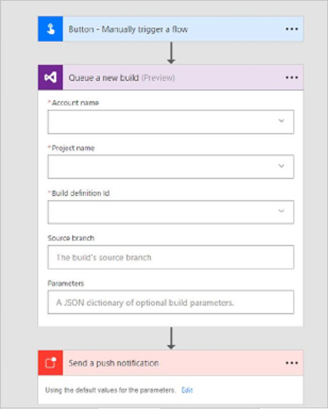  
8. Select or enter the **Account name**, **Project name**, **Build definition Id**, **Source branch** and optionally, **Parameters**, in the **Queue a new build** card:    
   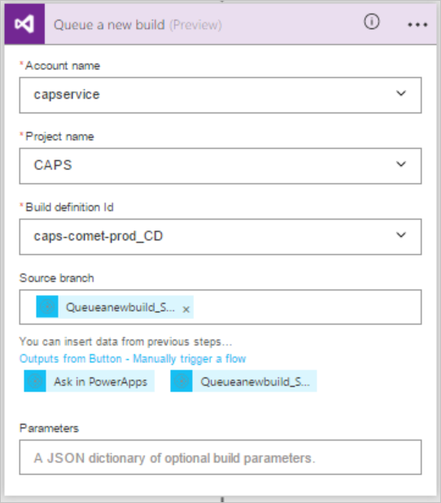  
9. Next, configure the properties of the push notification on the **Send a push notification** card. By default, this push notification is configured to send an HTML link to a Web page that displays the status of the build:  
   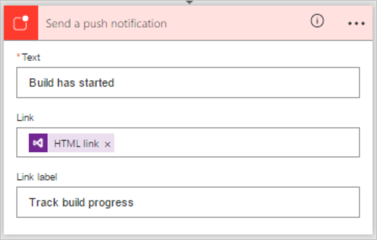  
10. Select the **Create flow** button to save your instant flow:
    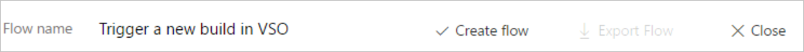  
11. You should see this success message within a few moments:  
    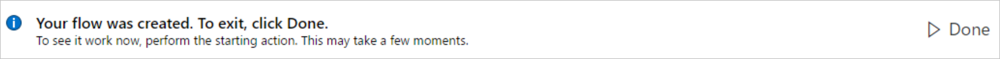  

Congratulations, you've created a instant flow! You can now run this instant flow anytime, any place, from the **Buttons** tab in the Flow app. Simply press the "button" and it will run! The Power Automate mobile app is available for [Android](https://aka.ms/flowmobiledocsandroid), [iOS](https://aka.ms/flowmobiledocsios), or [Windows Phone](https://aka.ms/flowmobilewindows).

### From your mobile device

>[!NOTE]
>While this walk-through displays screens from an Android device, the screens and experience on an iOS device are similar.

In the app:

1. Select the **Browse** tab and scroll to the **Button** category.  
   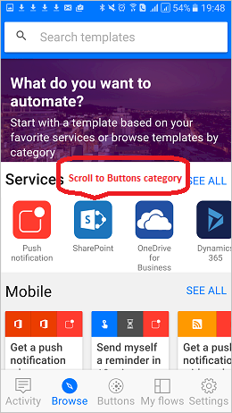  
2. Select the **See all** link. This displays all ready-to-go button templates.     
   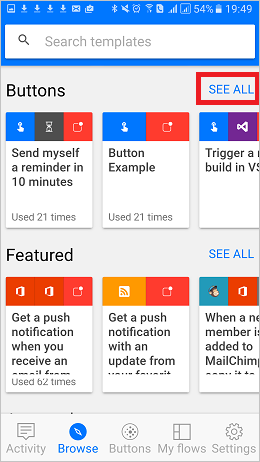  
3. Select the **Send an email to remind your team to join a meeting** template    
   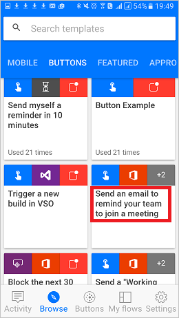  
4. Select the **USE THIS TEMPLATE** link, at the bottom of the page.    
   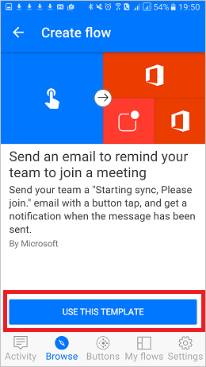  
5. You'll need to sign into all services that this template uses:    
   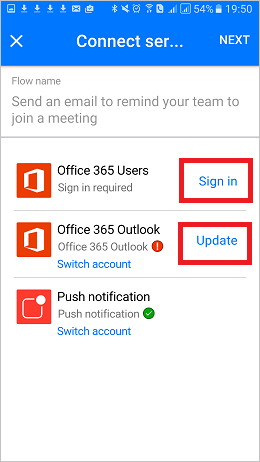  
6. Select the **Next** link after you've signed in to all services.      
   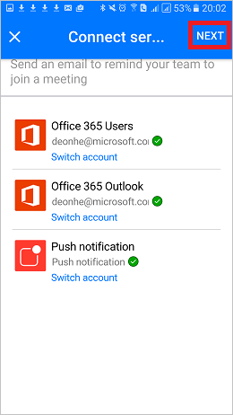  
7. Select the **Create** link. Here you can also review the flow and make any changes you require to personalize the email, for example.        
   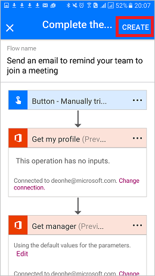  
8. After a few moments, the instant flow is created. Select **SEE MY FLOW**:   
   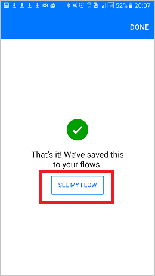  
9. View all your flows on the **My flows** tab  
   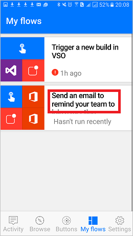  

Congratulations, you've created a instant flow! You can now run this instant flow anytime, any place, from the **Buttons** tab in the Flow app. Simply press the "button" and it will run! The Flow app is currently available on Android and iOS mobile devices.  

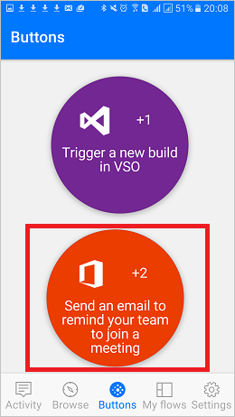  

## Trigger an instant flow
Now that you've created a instant flow, it's time to run it. Since you can only run instant flows from the Flow app, be sure you've installed Flow on your Android or iOS mobile device.  

1. Now, launch the flow app, tap the **Buttons** tab that's located at the bottom of the page, and tap the *button* that represents the instant flow you wish to trigger:  
   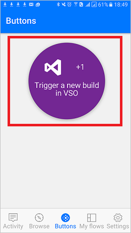   
2. See the progress while the flow runs:  
   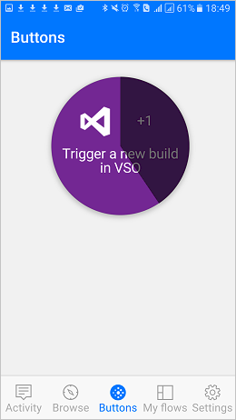   
3. Finally, the page updates, indicating that the instant flow has completed:  
   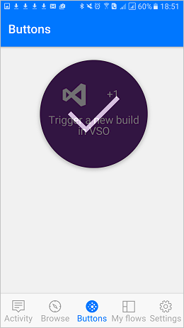   

That's all there is to running a cloud flow. 

You should now receive the push notification, indicating that the email has been sent.  

## Monitor your instant flow runs
You can monitor instant flows from the **Activity** tab of the flow app:   
  

>[!TIP]
>Tap any activity to drill into the results of the run to learn about the run.  

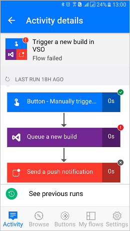  

## Manage instant flows
You have full control of your instant flows so you can enable/disable, edit or delete a button anytime, any place. From the mobile app or from the flow portal, select **My flows** to get started managing your flows.    

On the **My flows** tab of the Flow app:

1. Select the flow you wish to manage:    
   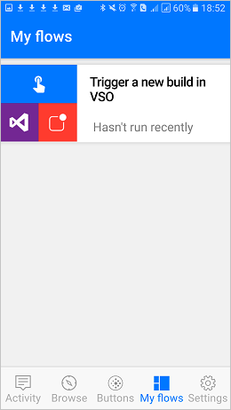   
2. You can tap any of these options, based on what you'd like to accomplish:    
   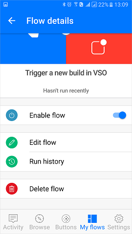  

   Tap **Delete flow** to delete a cloud flow.  

      >[!WARNING]
      >All run history is deleted when you delete a cloud flow.

      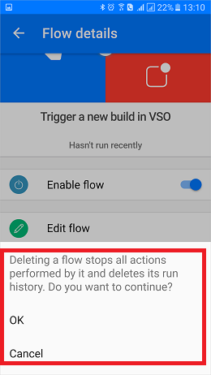   

   Tap **Update** after you are done editing a instant flow, to save your changes:   
   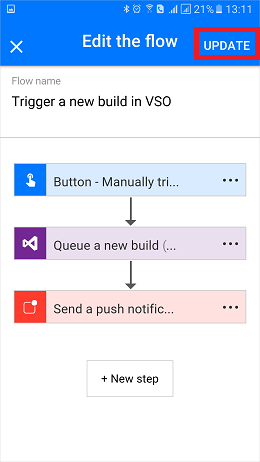   

   Tap **Run history** to see the results of all runs of a particular instant flow:    
   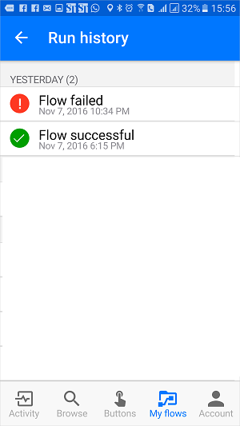  

   If you disable a cloud flow, it will no longer be available on the **Buttons** tab:    
     

## Next steps
* [Share instant flows](share-buttons.md).
* Learn to use [button trigger tokens](introduction-to-button-trigger-tokens.md) to send real-time data when your instant flows are run.
* Install the Power Automate mobile app for [Android](https://aka.ms/flowmobiledocsandroid), [iOS](https://aka.ms/flowmobiledocsios), or [Windows Phone](https://aka.ms/flowmobilewindows).

[!INCLUDE[footer-include](includes/footer-banner.md)]
