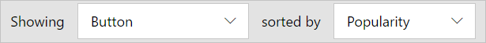

<properties
    pageTitle="Button flows | Microsoft Flow"
    description="Introduction to the button flows for Microsoft Flow."
    services=""
    suite="flow"
    documentationCenter="na"
    authors="msftman"
    manager="anneta"
    editor=""
    tags=""/>

<tags
   ms.service="flow"
   ms.devlang="na"
   ms.topic="article"
   ms.tgt_pltfrm="na"
   ms.workload="na"
   ms.date="10/25/2016"
   ms.author="deonhe"/>

# Introducing button flows

## What are button flows?
There are many repetitive tasks that we all wish we could execute with just a tap of a button. For example, you may need to quickly email your team to remind them to join the daily team sync, or you may want to start a new Visual Studio Online build of your code base after you've been notified that there are no more checkins planned for the day. Button flows allows you to accomplish these and many other tasks simply by tapping a button on your mobile device.

**Note** You can create button flows either from your mobile device or from the Flow portal.  
    

## Why create buttons?
Create buttons so that you can easily execute repetitive tasks from anyplace, at anytime via your mobile device. Executing buttons saves you time and, since the tasks they perform are automated, there will be less errors than if you manually did them.  

## Create a button 
**Prerequisites**
- Access to Flow. Your administrator can provide you with access.
- An account with permissions to use the connectors to create your flow. For example, you will need a Dropbox account in order to create a button that accesses Dropbox.

### From the portal
In this walkthrough, let's create a button that starts a VSO build and sends notifications to let you know when the build starts and when it ends:  

1. Select the **Showing** drop down list and choose the **Button** category to filter the list of templates to only those that can be used in button flows.  
   
2. Select the **Trigger a new build in VSO** template from the list of templates.  
  
3. Select the **Use this template** button on the **Trigger a new build in VSO** page.  
  
4. If you are not signed in, you'll be prompted to do so at this point:  
  
5. After you've signed into Flow, you'll be prompted to sign into the connectors for the template you have selected. In this example, in step 2 above we selected the **Trigger a new build in VSO** template, so we have to sign into VSO (and any other connectors you are working with), if you're not already signed in:   
    
6. Select the  **Accept** button if you agree to authorize Flow to access your VSO account.  
   
**Note** You'll need to authorize each connectors similarly. The designer should appear like this when you are ready to move on to the next step. Select the **Continue** button to move on:  
   
7. You are now ready to configure the properties for the build you wish to start:    
  
8. Select or enter the **Account name**, **Project name**, **Build definition Id**, **Source branch** and optionally, **Parameters**, in the **Queue a new build** card:    
  
9. Next, configure the properties of the push notification on the **Send a push notification** card. By default, this push notification is configured to send an HTML link to a Web page that displays the status of the build:  
  
10. Select the **Create flow** button to save your flow:
  
11. You should see this success message within a few moments:    
  

Congratulations, you've created a button flow! You can now execute this button flow anytime, anyplace, from the **Buttons** tab in the Flow app. Simply press the "button" and it will run! The  Flow app is available on Android and iOS mobile devices.  

### From your mobile device

#### Android or iOS

In the Flow app:  
1. Select the **Browse** tab and scroll to the **Buttons** category.  
  
2. Select the **See all** link. This displays all ready-to-go button templates.     
  
3. Select the **Send an email to remind your team to join a meeting** template    
  
4. Select the **USE THIS TEMPLATE** link, at the bottom of the page.    
  
5. You'll need to sign into all services that this template uses:    
  
6. Select the **Next** link after you've signed in to all services.      
  
7. Select the **Create** link. Here you can also review the flow and make any changes you require to personalize the email, for example.        
  
8. After a few moments, the button flow is created. Select **SEE MY FLOW**:   
  
9. View all your flows on the **My flows** tab  
  

Congratulations, you've created a button flow! You can now execute this button flow anytime, anyplace, from the **Buttons** tab in the Flow app. Simply press the "button" and it will run! The  Flow app is currently available on Android and iOS mobile devices.  

  

## Trigger a button flow
Now that you've created a button flow, it's time to run it. Since you can only run button flows from the Flow app, be sure you've installed Flow on your Android or iOS mobile device.  

1. Now, launch the flow app, tap the the **Buttons** tab that's located at the bottom of the page, and tap the *button* that for the button flow you wish to trigger:  
   
2. See the progress of the while the flow runs:  
   
3. Finally, the page updates, indicating that the button flow has completed:  
   

That's all there is to running a flow. 

You should now receive the push notification, indicating that the status of the build.  

## Monitor your button flow runs
You can monitor button flows from the **Activity** tab of the flow app:   
  

**Note**: Tap any activity to drill into the results of the run to learn about the run.  

  

## Manage button flows 
You have full control of you button flows so you can enable/disable, edit or delete a button anytime, anyplace, from the mobile app or from the flow portal. Just select **My flows** to get started managing your flows.    

On the **My flows** tab of the Flow app:
1. Select the flow you wish to manage:    
   
2. Tap any of these options, based on what you'd like to accomplish:    
  
3. Tap **Delete flow** to delete a flow.  

**Note** All run history is deleted when you delete a flow:   
   
4. Tap **Update** after you are done editing a button flow, to save your changes:   
   
5. Tap **Run history** to see the results of all runs of a particular button flow:    
  
6. If you disable a flow, it will no longer be available on the **Buttons** tab:    
  

## Next steps
- [Buttons blog post]() - todo
- [Install the Flow app for Android](https://play.google.com/store/apps/details?id=com.microsoft.flow)
- [Install the Flow app for iOS]()   - todo