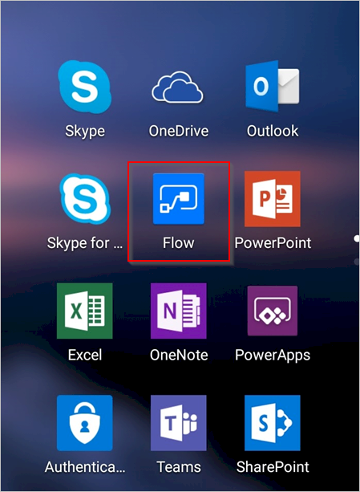
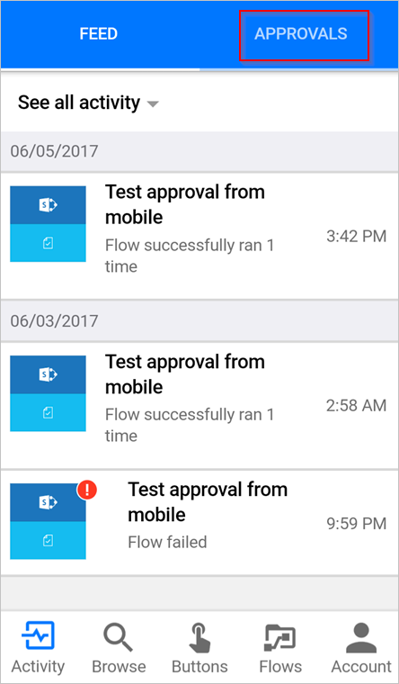
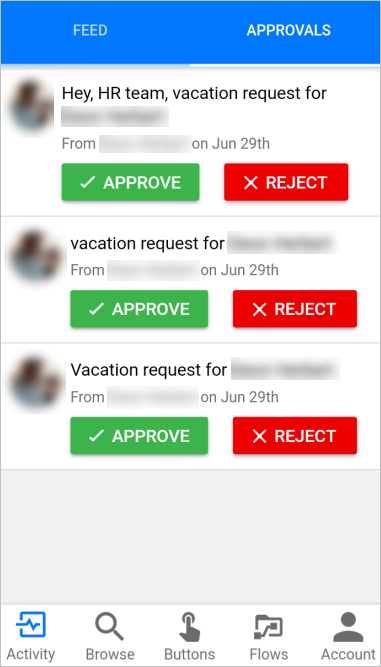
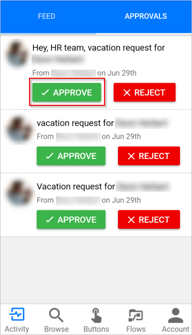
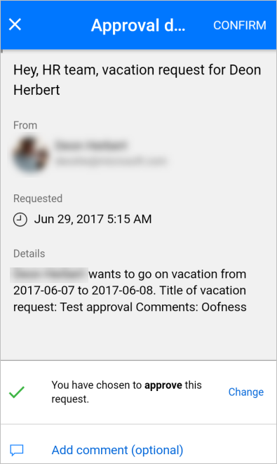

# Approve requests on your mobile device by using Power Automate

If a cloud flow identifies you as an approver and you've installed the mobile app for Power Automate, you receive a push notification whenever your approval is requested.

This article walks you through a few common scenarios that you’re likely to encounter while you manage approval requests in the mobile app for Power Automate.

> [!NOTE]
> The images in this topic are from an Android device; however, the experience on iOS is similar.
> 
> 

## Prerequisites
To complete this walkthrough, you need:

* An [Android](https://aka.ms/flowmobiledocsandroid) or [iOS](https://aka.ms/flowmobiledocsios) device running the mobile app for Power Automate.
* To be designated as the approver in an approval flow.
* Pending requests for approval.

## View pending requests
1. Open the mobile app for Power Automate.
   
    
2. Select **APPROVALS** in the upper-right corner.
   
    
3. View all pending approvals:
   
    

If you don't have any pending approval requests, create an [approval flow](modern-approvals.md), set yourself as an approver, and then trigger the flow. Approval requests appear in the approval center a few seconds after the flow triggers and sends a request for approval.

## Approve requests and leave an optional comment
1. If you haven't done so, follow the preceding steps to [view pending requests](mobile-approvals.md#view-pending-requests).
2. Select **APPROVE** on the request that you want to approve.
   
    
3. (Optional) select **Add comment (optional)**.
   
    
   
    Enter a comment on the **Add comment** screen.
   
    
4. Select **CONFIRM** in the upper-right corner.
   
    
   
    The success screen displays after the flow records your decision.
   
    

## Reject requests and leave an optional comment
Follow the [steps to approve a request](mobile-approvals.md#approve-requests-and-leave-an-optional-comment), but select **REJECT** in the second step.

## Learn more
[Create modern approval flows](modern-approvals.md).

[!INCLUDE[footer-include](includes/footer-banner.md)]
